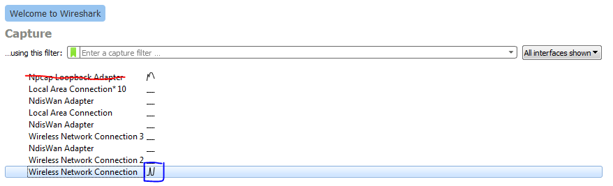
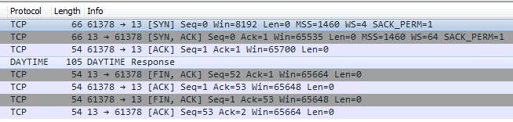
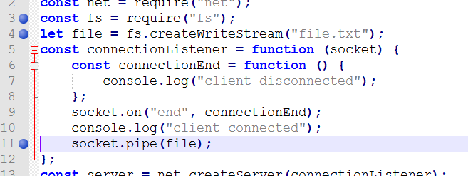
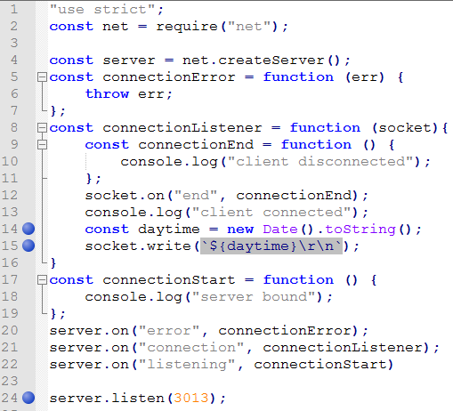
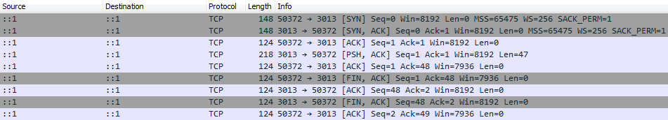
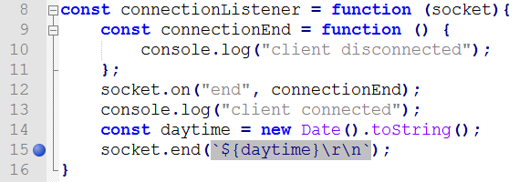
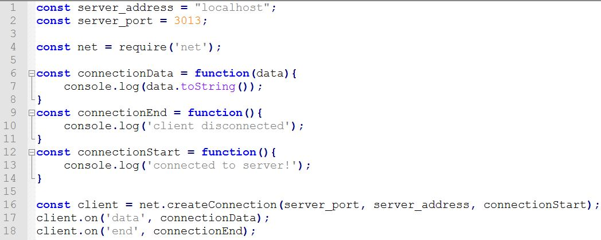
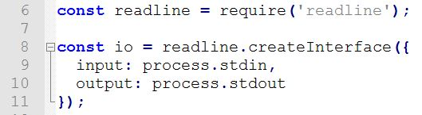
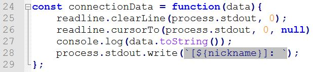

# TCP/IP Server

This assignment explores various simple application layer protocols and how messages are constructed using lower level protocols like TCP and IP.  Students will use packet sniffing software to intercept traffic arriving on their machine and build their own TCP servers using Node.js.

## Learning Goals

* Use Wireshark to analyze network traffic
* Understand TCP traffic flow and handshakes
* Understand TCP / IP datagram components
* Understanding the Node.js net package
* Writing a TCP server in Node.js
* Writing a TCP client in Node.js
* Learning about server-side event listeners.
* Introducing streams and sockets

## Software Required

> These instructions are designed with a Windows OS in mind.  They should technically work on Mac, but I cannot provide support if you have software problems.

* **Npcap**

  https://nmap.org/npcap/

  > Npcap is a **Windows** packet sniffing (and sending) library.

  * Used to capture network traffic.
  * If your using a Mac skip this.

* **Wireshark **(Install Npcap first)

  https://www.wireshark.org/#download

  > Wireshark is a network protocol analyzer.

  * Npcap only captures traffic, Wireshark adds a visual layer that can give a more in-depth analysis of the captured packets.
  * Do not install WinPcap (We are using Npcap) or USB debugging (We will not be capturing USB traffic)
  * If using Mac, install chmodBPF after installing Wireshark (comes with the dmg installer)
    * The assignment is designed with Windows in mind, if using different O.S. no support related to software issues is provided.

* **Netcat** via **MobaXterm Shell** (Home edition)

  https://mobaxterm.mobatek.net/download.html

  > Netcat is a networking utility for reading and writing on network connections using TCP or UDP.

  * Generates TCP traffic.  Acts as a TCP client for servers we will write in Node.js
  * MobaXterm's has a special version of Netcat in its Shell.  This version sends a `FIN` packet when a connection is closed.
  * For those using Mac, I don't see why Terminal wouldn't work, but no support is provided.  The `nc` comand should work.


- **Sequence Diagramming Tool**

  https://sequencediagram.org/

  > sequencediagram.org is a web based sequence diagram creator.
  
  * Click on the fourth icon `[?]` to learn the syntax required to create sequence diagrams.

* **PDF Reader capable of Form Filling**
  * One of the tasks requires you to fill out a pdf.  A fillable PDF is included. (Fall 2020 - you do not need to submit this)
* **Node.js**
  * TCP Server code will be written in JavaScript.  Node.js runtime  will execute the code.

## Setup

* Create a directory `A03-########` to keep all the files created, replacing `#` with your Student ID.  (For Fall 2020 you do not need to submit this, but it helps to keep everything organized)
* Start the `Node Command Prompt` and type `node -v` to check the version.  Ensure it is at least version 13.10.1  (If not download the latest version from the Node.js website)

## Reading

https://nodejs.org/api/net.html

* Server Events
  * `connection`
  * `listening`
* Server Methods
  * `net.createServer()`
  * `server.listen()`
* Socket Events
  * `close`
  * `connect`
  * `data`
  * `end`
* Socket Methods
  * `net.createConnection()`
  * `socket.connect()`
  * `socket.write()`
  * `socket.end()`

## NIST Daytime Client

We will be walking through the process of sending a DAYTIME request to the server `time-a-g.nist.gov` and analyzing the traffic generated.

1. Start Wireshark

   There should be two connections that are not flat, choose the one that is **not** `Loopback Adapter`, wired connections should be `Local Area Connection / Ethernet`, wireless should be `Wireless Network Connection`.



2. In the top left corner is the "Start capturing packets" button which has a shark icon.

   Click it and there will be a swarm of messages, as most computers have substantial background traffic.

3. Click the stop button.

4. Click the "Close this capture file" button which has the icon of a paper with an X.  Do not save the file.  We want to capture certain traffic, but there is noise in other networked applications.  We need a mechanism to filter the results.

5. We will get the Daytime from  `time-a-g.nist.gov	`, a server hosted by NIST

6. On Wireshark home, click the same connection as before 

   * Important, click before typing (step 7), but don't double click
   * The filter on Wireshark home (capture filter) and the display filter are not the same.  You cannot type port 13 into the display filter, you must go back to Wireshark home by clicking `Stop` and `Close Capture File`. 

7. Type into the capture filter bar

   ```
   port 13
   ```

8. It should turn green, click on the "Start capturing packets" button.  Wireshark will now start capturing any traffic between the local device and the any transmissions on port 13.

9. We will use Netcat to create traffic.  
   Start MobaXterm, Click `Session`  (Leftmost Icon not plural form), Click `Shell`, Click `OK`


10. In MobaXterm's Shell type in:

    ```
    nc time-a-g.nist.gov 13
    ```

    Double check that a date time value is printed, this may take two attempts.  If it fails to print the date or you see reset flags jump back to the step "Close the capture file"
    
    If you are still having issues try changing the domain to one of the following instead:
    
    https://tf.nist.gov/tf-cgi/servers.cgi

​	This will call the Netcat application to make a TCP request to the host `time-a-g.nist.gov` on port 13.

​	Port 13 is reserved for the Daytime Protocol

​	https://tools.ietf.org/html/rfc867

11. Switching back to Wireshark there should be some traffic.  Click the stop button to stop capturing.  Double check that the traffic has a total of **8 segments** and contains a segment with protocol DAYTIME.  If not, restart from "Close this capture file" until 8 segments are received.  You may also have to redo this step if you see a TCP Reset flag `[RST]`

    

12. There are 8 TCP segments in total, each one is wrapped with an IP header and an Ethernet frame.  Click on the drop down arrow to see the values.

    

    On each Layer click through each component to see where exactly each of the headers are. 
    
    The next question tasks you with filling out 8 diagrams with data from WireShark, one for each segment sent (Write on top of each section).  The PDF is fillable if you have the right software. **[16pt]**
    
    * If your computer is running IPv4 (most common) fill out the [following](nist-daytime-v4.pdf) diagram
    * If your computer is running IPv6 fill out the [following](nist-daytime-v6.pdf) diagram 
    
    For Sequence and Acknowledgement numbers write the relative value.
    
    


## Daytime Server

We will be walking through creating a Node.js server that simulates the TCP half of the Daytime Protocol (We skip the UDP portion as mixing TCP and UDP traffic increases the complexity)

0. Read the Daytime RFC

     https://tools.ietf.org/html/rfc867

1. Create a file `daytime-server.js` in the assignment directory.

2. Start with the code from here:

   https://nodejs.org/api/net.html#net_net_createserver_options_connectionlistener

   Save the file

3. Open `Explorer` and navigate to the assignment directory, Click the address bar and copy the path.

4. Start the `Node.js Command prompt ` and type in `cd` (Change directory) then paste the copied path.

5. To start the server, type:

   ```
   node daytime-server.js
   ```

   The message `server bound` should appear.  Leave this terminal open.

6. Type in the following to MobaXterm's Shell

   ```
   nc localhost 8124
   ```

   This will send a TCP request to port 8124.  `localhost` resolves to `127.0.0.1` which is a reserved IP address, called the local loopback which refers to the local computer.

7. The message `hello` should appear in MobaXterm's Shell, and `client bound` in the Node.js terminal.

8. Type your name and press enter into the MobaXterm Shell, the server should reply by repeating back any received message.

9. Press `CTRL + C` to end the communication. MobaXterm's version of `Netcat` sends a `FIN` to the server to end the connection, (not all versions of `Netcat` do this).  This lets the connection terminate gracefully and keep the server running.

10. Run netcat again.  (Do not terminate `daytime-server.js` )

    > Hint: Push up to cycle through previous commands

11. With the existing shell session still open, in MobaXterm start another Shell session and type in the same command again.  On the Node.js end, there should be two `client connected` messages in a row.  This demonstrates the TCP server's ability to handle multiple clients at the same time.

12. Close both connections and kill one of the shells.

13. Close the `daytime-server.js` with `CTRL + C`  

     Whenever the server code changes, the existing process needs to be restarted.

14. Rewrite the server code into the following:

     

    The functionality should not change, the reason for the rewrite is solely for clarity.  The initial code uses language constructs and objects that we may have only covered in limited amounts (arrow functions, connection listeners, and sockets)  The original code is cleaner, but also more complexity dense.

15. The following offers a line by line explanation of the above code

     * **Line 1**: `"use strict";`  Turns on strict mode, turning common mistakes into discoverable errors.

       https://developer.mozilla.org/en-US/docs/Web/JavaScript/Reference/Strict_mode

     * **Line 2**: `net` is Node.js's built in TCP library (`dgram` would be the equivalent UDP library).  Node.js separates its library code into packages which are imported using the `require` keyword.  All public methods of this package are then contained inside the newly created `net` object.

     * **Line 13**: Create a new TCP server of type `net.Server` using the `net` package

       https://github.com/nodejs/node/blob/bcef949c931f54e3d8ae2a1701f2538262e6bec9/doc/api/net.md#new-netserveroptions-connectionlistener

       `net.createServer` method accepts two optional inputs `options` (modifies the server's behavior) and `connectionListener` (`callback function` that fires when a new client connects)   

       * `options` is truly optional (the default values are what we typically want).  The sample code leaves this variable out.

       * `connectionListener` is optional, in the sense that without it, the code will not break, but it also does nothing.  The sample code assigns a variable `connectionListener` which is a function that listens for a `"connection"` event before running it's function body.

         https://nodejs.org/api/net.html#net_event_connection

         * `socket` - The first input variable of `connectionListener` is of type `net.Socket` and represents the connection that `connectionListener` responded to.  The variable name is unimportant (in the original code it was called `c`) what matters is that the variable is the first argument.

     * **Lines 15-18**: Defines a more typical event emitter for errors.  Lines 15-17 define what should happen in case of a server failure.  Line 18 creates an event listener that listens for a specific event.  The list of server events are `["close", "connection", "error", "listening"]`

       https://nodejs.org/api/net.html#net_event_close

       We could rewrite the code *(but don't)* using this listener format and it would behave the the same.

       

       I prefer this style as it's more uniform, but do not rewrite it *(yet)* as the line numbers would no longer match up making the rest of the instructions confusing.

       The reason the code is written the other way, is because the  `"connection"` event is the most important event for the server and defining it when creating the server is preferred by some.

     * **Lines 20-23**: Defines an anonymous function that is saved into the variable `connectionStart`.  When the server starts listening for connections, the function stored in `connectionStart` is called.  Server's do not start listening until the `listen` method is called which binds the server to a specific port number; 8124 in this case.

     * **Lines 4-12**: Defines an anonymous function that is saved into the variable `connectionListener` .  Whenever a client connects with the server, the function stored in `connectionListener` is fired and all the code inside is executed.   (Conversely if no client ever connects, this code never executes)

       This function has a single input `socket` representing the connection that was established.

       > **net.Socket**
       >
       > This class is an abstraction of a TCP socket... A `net.Socket` is also a [duplex stream](https://nodejs.org/api/stream.html#stream_class_stream_duplex), so it can be both readable and writable, and it is also an [`EventEmitter`](https://nodejs.org/api/events.html#events_class_eventemitter).
       >
       > https://nodejs.org/api/net.html#net_class_net_socket

       * **stream** - Streams deal with controlling data flows from various sources.  They are useful for data sources that may not have a well defined start and end (like user input).

         - **writable**: An abstraction of a data source that is created

         - **readable**: An abstraction of a data source that is consumed

           - `readable.pipe(writable)` 

             A method of the `readable` stream that directs the input (`readable`) to an output stream (`writable`)

             https://nodejs.org/api/stream.html#stream_readable_pipe_destination_options

         - **duplex**: both readable and writable at the same time, in a later assignment we will use `http` which can better separate request from response.

       * **EventEmitter**: individual connections can emit event similar to how the server can emit events.  We can set up listeners that fire when events are emitted.

     * **Line 5-7**: Function inside of a function.  This is allowed in JavaScript, the function stored in variable `connectionEnd` is scoped to only exist inside the `connectionListener` function.
    
     * **Line 8**: Binds the function `connectionEnd` to the socket's  `end` listener.  When the `end` event is emitted from the socket `connectionEnd` will execute.

Socket's have 9 events that can be emitted vs. a server's 4.

`["close", "connect", "data", "drain", "end", "error", "lookup", "ready", "timeout"]` 

https://nodejs.org/api/net.html#net_event_close_1

* **Line 10**: Writing to connected client

* **Line 11**: Sockets are duplex, meaning we can read from them as well.  This line reads the next input the client sends and directs the input to be sent back on the same stream.

  **Changing the code to:**

  

  will send the typed message to a file `file.txt`

  **Changing the code to:**

  

  will send the contents of `file.txt` to any client that connects.

  *(Yes, the contents of one file can be piped to another)*

16. Change the code to the following:

    

17. Start the node server.

18. Start Wireshark, this time use the `Loopback adapter`.  This allows us to capture loopback traffic (has the same origination and destination).

19. Change the capture filter to `port 3013`, start capturing data.

20. In MobaXterm Shell type `nc localhost 3013` which will create 5 packets in Wireshark.  

21. Press `CTRL + C` to close the connection which will generate the next 4 packets.

    

    Notice that the traffic generated is not identify as a `DATETIME` packet by WireShark.  This is because this example uses port 3013, and not the standard port 13.

    Side note: I choose port 3013 instead of port 13, because some computers have these test services running and I want to minimize the chance of conflicting with the OS's version of daytime/qotd/echo.  In general try to avoid using low numbered ports in the range 1-1023 when writing programs.

22. Draw the network traffic diagram for these 9 segments. **[10pts]**

    Use <https://sequencediagram.org> to draw the diagram (The 4th icon `[?]` covers the syntax)

    * Example network traffic diagram:

      https://www.youtube.com/watch?v=F27PLin3TV0

    Include relative sequencing numbers/acknowledgement numbers, flags, and payload data/protocol  (if available)  The sample video does not include all of these.

    On the diagram identify the 3-way **connection** handshake and the 4-way **termination** handshake

    * https://en.wikipedia.org/wiki/Transmission_Control_Protocol#Connection_establishment

    * https://en.wikipedia.org/wiki/Transmission_Control_Protocol#Connection_termination

    Save it as `daytime-traffic-segments-01.png`

    *Since the machine running the client/server is the same it will have the same IP: to differentiate client from server traffic look at the ports.*  (One will use a high numbered ephemeral port)

23. In the previous example the client ended the connection.  

    Change the code on line 15 to the following:

    

    and capture the traffic again.

24. Draw the sequence diagram for the traffic of these 9 segments.  **[5pts]**

    Save it as `daytime-traffic-segments-02.png` 

## Daytime Client

Next we will write a dedicated client program that will query the server, so that we no longer need to use `netcat`.

0. Read up on `net.createConnection()` (third signature)

   <https://nodejs.org/api/net.html#net_net_createconnection>

1. Create a new file `daytime-client.js`

2. Add the following code:

   

   `net.createConnection`: creates a socket

3. Start a command prompt and start the server

4. Start a second command prompt and run the client.

5. In the code change the value for `server_address` to `time-a-g.nist.gov` and `server_port` to `13` and run it again.

6. Repeat the process one more time, this time using wireshark to capture the data, make sure to listen on port 13.  Save the capture file as `daytime-client.pcapng` **[5pt]**

## QoTD Server

Write a TCP server according to the following specs:  (Students only need to write the TCP server, skip UDP, don't write a client, instead use netcat to test it)  Use port 3014.

https://tools.ietf.org/html/rfc865  

Save it as `qotd-server.js` **[10pts]**

Have at least 7 different quotes that will change each day.  You may decide the quotes.


Use Wireshark to capture the traffic. Examine the network traffic, specifically the contents of the payload packet (quote) 

Draw the sequence diagram.  Save it as `qotd-traffic-segments.png` **[10pts]**

## echo Server

Write a TCP server according to the following specs:  (Students only need to write the TCP server, skip UDP, don't write a client, instead use netcat to test it)  Use port 3015.

https://tools.ietf.org/html/rfc862  

Save it as `echo-server.js` **[5pts]**

Use Wireshark to capture the traffic. 

Wireshark will classify the payload packet as generic TCP because the port number is unrecognized.

Generate two echo statements `CS355` and your `student_id`.  Then close the connection using `CTRL + C`.

Draw the sequence diagram.  Save it as `echo-traffic-segments.png` **[10pts]**

### Hint

<https://nodejs.org/api/net.html#net_net_createserver_options_connectionlistener>

Remember that sockets are bidirectional.  Any socket can be both read from and written to.

## TCP Chat Server and Client


There will be two files, a server and a client.  There will be only one instance of a server, but there can be many clients.  All connected clients can send a message to the server which will then be sent to all other clients. **[29pts]**

### Server

Start with a copy of `daytime-server.js` as a starting template, save it as `chat-server.js`

The server will need to listen to the following events:

* `error`: Throw an error

* `listening`: Print `server bound` to console.

* `connection`: Called when a client connects.  Set up three listeners, then adds the socket of the current connection to an array of all connections.  Finally add `console.log(socket.remotePort);` to the end of the "connection" event handler to see the unique ports  being used by clients

  Once a connection is established the socket will listen to the following events:

  * `end`: print `client disconnected` and remove that socket from the connections array.

  * `error`: same

  * `data`: Use `socket.write()` to send the data to everyone except the current connection.

    <https://nodejs.org/api/net.html#net_socket_write_data_encoding_callback>


### Client

Start with a copy of `date-time-client.js` as a starting template, save it as `chat-client.js`

Create a variable `nickname` on top, but don't set it to anything yet.

Add the following code to setup console input.



<https://nodejs.org/api/readline.html#readline_readline>

We will need to implement the same methods, `connectionData`, `connectionEnd`, and `connectionStart` as the client needs to accommodate for these three actions.

`connectionStart()` will ask the user to choose a nickname and then call a new function `chat()`.  
Use the `readline.question()` method to capture input.

<https://nodejs.org/api/readline.html#readline_rl_question_query_callback>

`chat()`: 

1. print the users nickname surrounded in braces

2. Wait for user input

3. Check if input is the string `/exit`, if so use `socket.end()` and `process.exit();` to exit

   ```javascript
   client.end(function(){process.exit();});
   ```

   `client` represents the variable name of the socket to be closed, it is not a keyword.

   <https://nodejs.org/api/net.html#net_socket_end_data_encoding_callback>

4. Otherwise use `socket.write()` to send data to the server to be propagated to all clients, prefix the message with the users nickname in square braces.

5. Call the `chat()` function recursively. (Chat messages from the same user should be synchronous).  

   

`connectionEnd()`: is unchanged, will also print `client disconnected`

`connectionData()`:



* Line 25 clears the TTY console.
* Line 26 moves the cursor to the beginning of the line.
* Line 27 prints the data received and a newline
* Line 28 Rewrites the erased prompt.

### Hints

* First try getting the message sent to all connected clients.  Then try to exclude the sending client from the recipient socket list.

  

This chat application should work with different machines if you have friends to test it with, (just plug in their IP address) but it's not necessary to perform this testing.


