# Assessment 04: Album Art Finder


## Assignment Goals

* Creating a HTTP Server with Node.js
* Parsing URLs and Query Strings
* Creating HTTP Requests and processing HTTP Responses
* REST APIs
  * How do websites that offer a REST API manage requests?
  * Authentication
  * Request Types
* Caching


## Template Files

[04-album-art-finder.zip](resources/04-album-art-finder.zip)


## Software Library Restrictions

One of the goal of this assignment is to familiarize students with buffers, streams, asynchronous programming and, the base Node.js language.

Specifically for this assignment you only need the following built in libraries.

* https://nodejs.org/api/http.html - HTTP to serve websites to others

* https://nodejs.org/api/https.html - HTTPS to fetch data from API's

* https://nodejs.org/api/fs.html - IO

* https://nodejs.org/api/url.html - Break up a URL into it's components

* https://nodejs.org/api/querystring.html - Conversion of Query String to Object


Students are restricted from using NPM libraries (npmjs.com) as they abstract away many difficulties that this assignment is training you to identify.  (Similar to how in CS111 you are prevented from using the `#include <vector>` library)

Students will receive no credit for submissions that use npm libraries, so be careful as many solutions online for subtasks will utilize these libraries.  

Some popular libraries that are **banned** from this assignment

* request https://www.npmjs.com/package/request
* express https://www.npmjs.com/package/express

> If the library is available on nodejs.org you can use it, if it's on the npmjs.com website it's barred from this assignment.

StackOverflow usage is permitted in a read-only fashion for subtasks (Do not ask questions on the platform, instead direct all questions to me)  Many examples use banned third party packages so be careful not to use those answers.


## HTTP Debugger

<https://insomnia.rest/>

This tool makes debugging HTTP requests much simpler than doing it from within Node.js  You can isolate malformed requests from within a HTTP debugger before mixing in code so you can isolate problems right away.


## Create a Server

`http.createServer` has a callback that creates two variables request (`req`) and response (`res`).  

Request is of type `http.IncomingMessage` which extends the ReadableStream

https://nodejs.org/api/http.html#http_class_http_incomingmessage

Response is of type `http.ServerResponse` which technically extends Stream, but we can treat it as a WritableStream with additional methods, as for our purposes all the events and methods that we used previously, are still available. 

https://nodejs.org/api/http.html#http_class_http_serverresponse

This is in contrast to TCP streams which gave us a single duplex stream on connection.


1. Open `index.js`

2. Create an HTTP server, add the following code to create an HTTP server.

   

3. Start the server by running the command `node index.js` in the node command prompt

4. Open a browser and in the address bar visit `localhost:3000` to ensure your server is running.  You should see two requests in the command prompt and the message Hello World in your browser.  If you don't see the request for favicon.ico press `CTRL+F5` to perform a hard refresh (ignore cache)

   

   

5. Change the code to print your name instead of Hello World.

   (Kill the server by pressing `CTRL + C` from within the node command prompt.)

6. **Remember to restart the server after each change in your code**


## Routing

`req.url` represents the path the client requested.  `req.url` removes the domain information from the url to focus on the path portion.  While the server is running type into your browser.

`localhost:3000/does-not-exist`

You should get back the same result as the server is configured to `res.write()` to send the exact same message back for every request it receives.  Using `if/else statements` we will parse six different types of requests:

 1. A request for the root directory of our site: `/`

 2. A request for a favicon image that matches `/favicon.ico`

 3. A request for a banner image that matches `/images/banner.jpg`

 4. A request for an asset inside a directory `/album-art/` for example 

   `/album-art/5c3cf2ee3494e2da71dcf26303202ec491b26213.jpg`

 5. A request for a page `/search` which can contain query strings like 

   `/search?artist="Taylor Swift"`

6. A catch all request for anything else


Deliver content using pairs of `res.write()` followed by  `res.end()` (removing the previous pair that printed your name)

For the first three you can use a simple comparison (eg. `req.url === '/'` )

For the next two use [`String.prototype.startsWith()`](<https://developer.mozilla.org/en-US/docs/Web/JavaScript/Reference/Global_Objects/String/startsWith>)

For the webpage requests deliver the text `REPLACE WITH HOME`, `REPLACE WITH SEARCH`, and `REPLACE WITH CATCHALL`  for now.

For the favicon and images requests deliver the text `REPLACE WITH FAVICON` and  `REPLACE WITH IMAGE` for now.

Use a browser to test each requests by copying each of the examples above and appending it to the end of `localhost:3000`, you should have different responses depending on the URL.  The image paths will display errors because of the browser guessing incorrectly the MIME type based on the extension, but we will fix it soon.


### / (root)

1. Open `html/main.html` in a text editor and add the following

   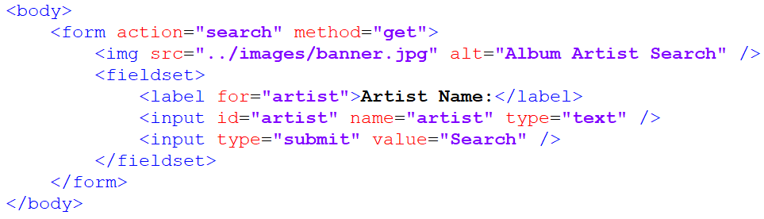

   This creates an HTML form that accepts a single input `artist` from the end user sends the data to the url `/search`


1. We want to serve this file to any clients who visit the root of our site. 

2. For the route "/" replace the existing code with the following:

   

3. This opens a ReadStream to the html file.

4. We then pipe the file `main.html` to the client as our response.  Pipe by default will close the response once the stream is finished so there is no need for `res.end()`

5. [`res.writeHead()`](https://nodejs.org/api/http.html#http_response_writehead_statuscode_statusmessage_headers) is used to supply header information to the browser which tells it how to interpret the data being sent (as the filename is not transmitted when sending a stream of data)  

   If left out, the browser will try it's best to figure out how to interpret the data, but its better to be explicit.

   In this example we are supplying it two parameters 
   
   `statusCode` which represents a general category of how the request was handled.
   
   200 or `OK` is the most common status code, signaling the request was successfully completed.
   
   The second parameter is the Response `headers` object which is used for a variety of purposes including specify the document type, length, encoding, compression, expiration (how long can it keep this resource cached), and other meta information regarding how the browser should interpret the data transmitted.
   
   https://developer.mozilla.org/en-US/docs/Glossary/Response_header
   
   This object can have many components, but our example only has one, the Content Type.  Content type  elaborates on how a given file should be interpreted, the specific values that browsers understand is maintained by IANA called the MIME type.
   
   https://en.wikipedia.org/wiki/Media_type
   
   You don't need to memorize these values.  Typically when I need to lookup the MIME type, a quick web search will get the results.  For example a quick search for `MIME type .mp3` will yield `audio/mpeg`.
   
   The browser downloading the file will see the MIME type and open the file with the appropriate tool (eg. audio player, video player, pdf reader, or web page) 
   
   `res.writeHead()` method must be called before any data is transmitted. (Call it before any calls to `pipe()`, `write()`, or `end()`)
   
   
   
   

### /favicon.ico

When visited browsers will automatically request a favicon asset when you visit a site, if you send back a `.ico` file it will display it in the top corner of the browser tab representing the site icon.  

> There are a few clever hacks done with this like notifications (Gmail unread count), counters (Google Calendar dynamic date), and recently a full game
>
> <http://www.p01.org/defender_of_the_favicon/>

1. Using `fs.createReadStream()` create a file stream for the file `images/favicon.ico`
2. Content type is `'image/x-icon'`
3. Pipe the contents to the response.
4. Navigate to `localhost:3000/favicon.ico`, you should see the image
5. Navigate to `localhost:3000/index.html`, you should see the image in the top corner of your tab.  The browser automatically makes secondary requests.  Typically this is based on what resources are embedded on the HTML received, but favicons are a special case that most browsers try to get even if it wasn't explicitly specified in the HTML.  (The browser will automatically check `domain.com/favicon.ico`)


### /images/banner.jpg

After the browser downloads the file `html/main.html` it will automatically begin parsing the document, when it encounters an embed resource ``  The browser will make a secondary request to the server for this resource.  This is why sometimes you may sometimes see partially loaded websites, the browser is still downloading certain embedded resources.

It will do this for all embedded resources like stylesheets, scripts, images, audio, and video.  Hyperlinks however are not downloaded and only get requested when the user clicks on them.  (A web page could have hundreds of links to large files, it only makes sense to download those resources if the user clicks on the link)

Right now the request is being made we can see that by navigating to `localhost:3000/` in a browser, toggling the web inspector tools `CTRL + SHIFT + I`, and performing a hard refresh `CTRL + F5`


You should see requests for `banner.jpg`, this request is successful, but it is not actually delivering the image.


1. Using `fs.createReadStream()` create a file stream for the file `images/banner.jpg`
2. Using Content type is `'image/jpeg'`
3. Pipe the contents to the response.
4. Restart the server and navigate to `localhost:3000/` you should see the banner image.


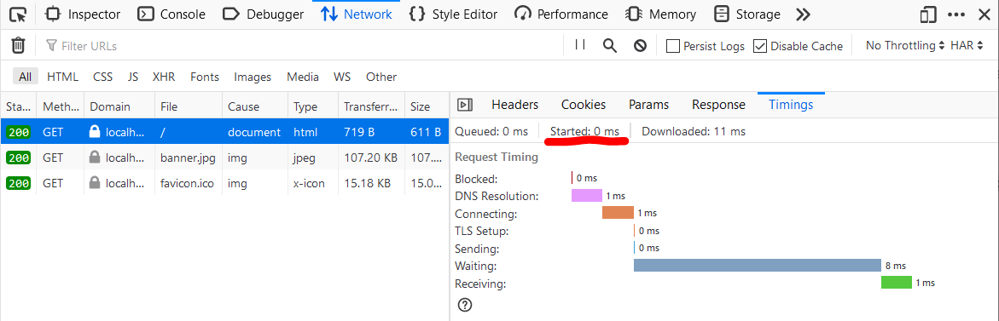

We can look a bit more in-depth at how each of the resources arrive in your browser by clicking through each request and going to the Timings tab.  Started time gives us a relative time value for when a particular request was sent out from your browser.  Notice `favicon.ico` starts downloading substantially later than `banner.jpg`.  Most browsers deprioritize favicon requests and will request them after everything else on the page has been downloaded and executed.  This is typically referred to as lazy loading.  This is actually a rabbit hole that you can go very deep into exploring how to optimize page load times, but it's not for us.


### /album-art/

images that we are going to work with are going to have the format 
`/album-art/5c3cf2ee3494e2da71dcf26303202ec491b26213.jpg`

To service a request for the above file our application will check the `/album-art/` directory for a file with that filename **and if available**, pipe the result back to the user.

* In the previous examples we can be confident that the images will exist, but this is not the case for this example.  The standard way to respond to request for files that don't exist is to send a 404 status code.

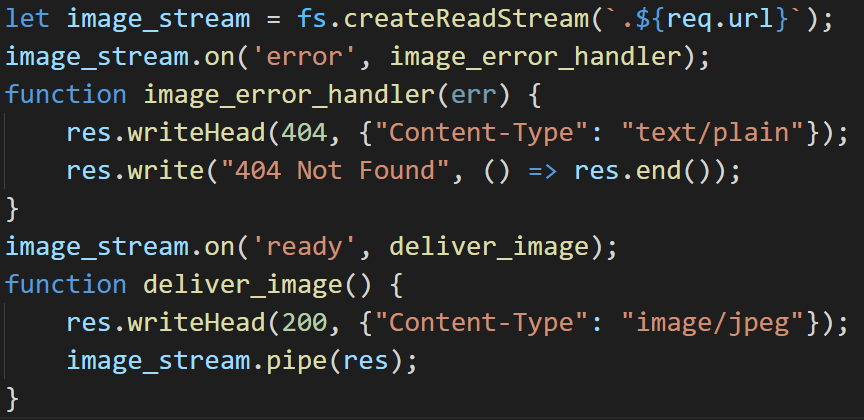

The `ready` event is emitted when the image has been loaded into memory.

I've already created two test image inside album-art.  Restart the server and in a browser navigate to  `localhost:3000/album-art/test1.jpg` and `localhost:3000/album-art/test2.jpg` and ensure that you see the images.

Then navigate to `localhost:3000/album-art/does-not-exist.jpg` and ensure you are getting a 404 Not Found message.

We can replace the `res.write("404 Not Found", ()=> res.end())` 
with a `res.end("404 Not Found")` which is equivalent to the above.

### /search (part 1): delivering the form

When the end-user fills out the form from `/`, the data will be appended to the URL as a query string.

https://nodejs.org/api/url.html#url_url_strings_and_url_objects

The chart on this page shows the structure of the URL.  The `url` library will be helpful here.  It allows you to input a URL and using the `parse()` method break it up into useful components.

1. Create a new URL object by feeding in `req.url`

2. Check `url_object.searchParams` to learn the structure of the object

   Example

   https://nodejs.org/api/url.html#url_class_urlsearchparams

3. Print the string `artist` to console

   https://nodejs.org/api/url.html#url_urlsearchparams_get_name

   


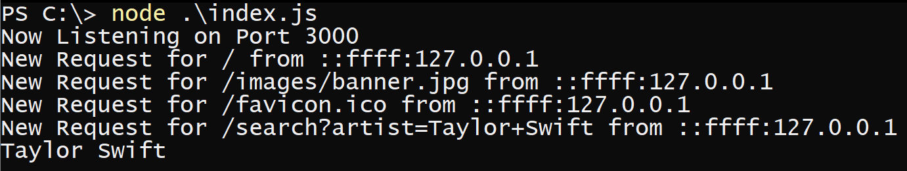


## else

Send a 404 Not Found response, and close the connection.


## Using a REST API

A REST API is an interface from which our application can communicate with third party servers to fetch data or request services.  For example the Google Translate API can convert between various languages which can be useful in certain applications.  To interact with it programmatically we use APIs.

Spotify is a streaming music platform that offer's music subscriptions, they also have a very beginner friendly API.  

This assignment will have students utilize Spotify's API to lookup album art related to a search term and display results.

### Setup a Spotify Account

1. You need a Spotify account to use the API, if you don't have one or have concerns about privacy you can create a new one (free accounts work fine)

   [https://www.spotify.com](https://www.spotify.com)

2. Navigate to the developer dashboard

   [https://developer.spotify.com/dashboard/](https://developer.spotify.com/dashboard/)

3. Click Create an App

   ​	Name: `CS355 Album Art Search App`

   ​	Description: `Learning Spotify API 1 - Client Credentials Grant`

   ​	What are you building? 

   ​	Choose `I don't know`  , `Next` , Check all the boxes, and `Submit`

4. Click on the project to find your credentials.

   

5. Client ID is the identifier for your application

6. Client Secret is your application's password


### Authentication

1. We will store credentials in a json file inside `/auth/`.  Be careful to not share this file as it allows anyone who has it to impersonate your application.  Spotify's API is free, but for billed API's like AWS, accidentally publishing your client secret can be an extremely expensive  mistake.

   > *Accidentally* pushing API keys to GitHub can be an *Expensive/Stressful Lesson*: 
   >
   > A group of bitcoin miners evidently ran a script to find client secrets for servers on GitHub and took control of the AWS account.  After just one week of the account being compromised, the monthly bill was $285,000!
   >
   > https://www.quora.com/My-AWS-account-was-hacked-and-I-have-a-50-000-bill-how-can-I-reduce-the-amount-I-need-to-pay

   In the future, I hope to add a section related to protecting your keys using environmental variables, but for now I'll post some resources at the end of this assignment if you want to look further into it.  For now ensure that your keys are centralized into a single location `/auth/credentials.json`  and that file never gets shared, use gitignore files if using Git/Github.

   

2. Open `/auth/credentials.json`.  The JSON file should represent an object with `client_id` and `client_secret` attributes set to be the values Spotify has given us.  Add these values.

   Use https://jsonlint.com/ to validate your JSON.  (Pitfalls: JSON requires double quotes for all strings)

   This is done to avoid hard coding credentials into `index.js`

   We can import the `credentials.json` file by using a require statement.

   Add the following to your `index.js` file

   ```javascript
   const credentials = require('./auth/credentials.json');
   ```

   This will automatically parse the JSON string into a JavaScript object.

3. To get Spotify to accept our queries the application needs to identify itself by sending it's client_id and secret.  There are three different types of authorization flows, (Authorization Code, Implicit Grant, and Client Credentials) each which serve a different purpose.  

   For this assignment we will be using the ["Client Credentials Flow"](https://developer.spotify.com/documentation/general/guides/authorization-guide/#client-credentials-flow)

   Keep this link open, as I will refer to it as the Spotify Authorization doc.

   
   

Client Credential allows us to access resources that are independent of any particular user.  In our example album art does not change from user to user.  In contrast, if we were to try to access a particular Spotify user's personal playlists, we would need to explicitly ask for permission from that user (using either Authorization Code or Implicit Grant).  


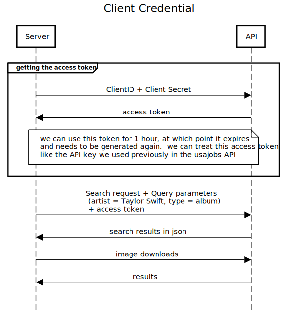


Conceptually Client Credential and API Key authentication are roughly the same.  The main benefit between of Client Credential over API key authentication is that we can transition from Client Credential to 3-Legged OAuth fairly easily, where as API key requires an entire rewrite.  Technically there is an additional initial handshake where our server sends Client ID and Secret to the API in exchange for an access token.  This access token is then attached to subsequent requests.  Typically these access tokens also expire and a new one needs to be requested again after a window (1 hour in the case of Spotify)


   #### Testing the Request

Debugging HTTPS errors from within Node.js is not a good idea.  Instead there are dedicated tools like Insomnia and Postman.  I'll be stepping through a quick tutorial on how to use Insomnia.

   

   From the main window create a New Request, call it Spotify and change the request type to POST

   > The request is sent to the `/api/token` endpoint of the Accounts service:
   >
   > ```
   > POST https://accounts.spotify.com/api/token
   > ```
   >
   > The body of this POST request must contain the following parameters encoded in `application/x-www-form-urlencoded` as defined in the OAuth 2.0 specification:
   >
   > | REQUEST BODY PARAMETER | VALUE                                        |
   > | ---------------------- | -------------------------------------------- |
   > | grant_type             | *Required.*  Set it to `client_credentials`. |
   >
   > -Spotify Authorization doc

   First add Spotify's API endpoint into the URL bar on top.

   The OAuth 2.0 specification dictates that the body type will be `application/x-www-form-urlencoded`, this means the body should be interpreted as Form URL Encoded.  Click the arrow next to Body and click Form URL Encoded.

   This will add a new value to Header `Content-Type` : `application/x-www-form-urlencoded`

   Next in the Form Body we will add `grant_type` : `client_credential`

   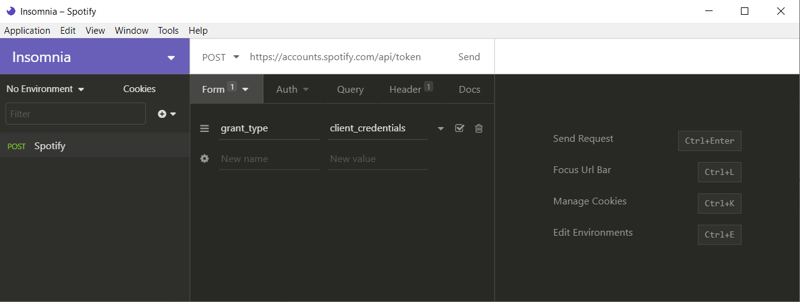

   Next the Header

   > The header of this POST request must contain the following parameter:
   >
   > | HEADER PARAMETER | VALUE                                                        |
   > | ---------------- | ------------------------------------------------------------ |
   > | Authorization    | *Required.*  Base 64 encoded string that contains the client ID and client secret key. The field must have the format: Authorization: `Basic <base64 encoded client_id:client_secret> ` |
   >
   > -Spotify Authorization doc

This one is harder because while we do have the `client_id` and `client_secret` we need to combine them into a single base64 encoded value.  I've already written a script to do this.

   

Type it up into a new script file, add your client id and secret, and run it to get the value required for Authorization.

   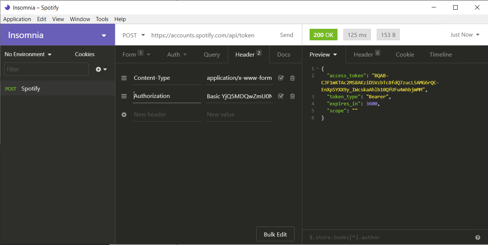

Click send and you should get an `access_token` which can be used to query other endpoints for data.  This token is valid for 1 hour, and after that a new token must be requested.  In the response go to Timeline and scroll down to see the full request.  Notice the purple line

> grant_type=client_credentials

This is the Body information represented as `application/x-www-form-urlencoded` data

**The next steps will have students to go through this exact process from within Node.js.**


3. We need two objects `post_data` representing our Form Body Data containing `grant_type`  and a Headers object containing `Content-Type` and `Authorization`

   Create two objects `post_data` and `headers` with these properties.

   In the `headers` object add an additional property `"Content-Length"` and set it to be the calculated value `post_data.length`.  (That's why I requested `post_data` be created first)  This value was automatically added by insomnia and I believe Node.js will also automatically add in when it knows the length, but it's better to be explicit.

   

   Use the previous code to generate the base64 encoded string.  Instead of printing it out, use the variable `base64data` as part of the next request made.

   

4. The authentication server only accepts HTTPS POST requests to the API endpoint

   `https://accounts.spotify.com/api/token`
   
5. Include the `https` library if you haven't done so already.  (We need both `http` and `https` libraries)  

   * `http` for our server (so we don't have to deal with certificates)
   * `https` so we can make requests as clients to API's.  (If you look at the previous URL it is using the `https` protocol, `https` cannot communicate with `http`)

   

6. `post_data` needs to be in querystring format.  Currently it is in JS object format (eg. `foo=bar&baz=qux`)

   > https://en.wikipedia.org/wiki/Query_string

   There is a built in library `querystring` with a method `stringify` that can convert an object into a querystring.

   https://nodejs.org/api/querystring.html#querystring_querystring_stringify_obj_sep_eq_options

   Convert `post_data` to a querystring using this method

   

7. To create a POST request use the `https.request()` method we need to utilize all three arguments

   https://nodejs.org/api/https.html#https_https_request_url_options_callback

   Look through the options here

   https://nodejs.org/api/http.html#http_http_request_options_callback

   

8. Create an object `options` with two properties 

   * `method` set to `POST`
   * `headers` set to be the headers object we created earlier.

   This is describing our request as well as embedding header information.

   

9. Create the request using `http.request` supplying it relevant data.  

   

   

   The `stream_to_message` function is a utility function created to wait for a stream of data to be completely collected before executing the callback (next phase of execution).  This will be used multiple times in this program (each time we have a stream of text data we need to process) so I moved it to the top.   

   `stream_to_message` operates as follows, it listens on a `stream` (in our example these will be sockets) and each time a `data` event occurs it casts the chunk to text (don't use this for binary data) and then appends to `body`.  Finally when there is no more data an `end` event is caught which executes `callback` (next function in execution) passing in `body`

   

   

10. Add in the code for `auth_sent_time` we will use it for caching later

11. `https.request()` creates a new `ClientRequest` object

    https://nodejs.org/api/http.html#http_class_http_clientrequest

    `ClientRequest` represents Node.js's internal representation of a **(currently unsent)** request to the Spotify URL.  This object extends stream and add 8 new events.  We listen to two events `error` (part of stream) and `response`.  

    https://nodejs.org/api/http.html#http_event_response

    > Emitted when a response is received to this request. This event is emitted only once.

    Because it is only emitted once, I listen to it using `once()` instead of `on()` to be explicit about it's behavior, in case I need to come back to the code later.

    

    When we are ready to send the request we can either use `auth_req.end()` or `auth_req.write()` if we want to keep the connection open (we don't in this case)

    

    We pass in any data that should be part of the body of the request as the parameter to `socket.end(data)` or `socket.write(data)`.  For most `POST` requests this is a querystring.

    

12. If successful you should see something like this without the formatting.

    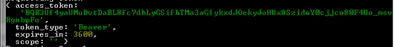

    

    Replace `console.log` in the previous code to `received_authentication` making sure to include `message`, in addition also pass in variables `user_input`, `authe_sent_time`, and `res`

    

13. Write the function `received_authentication` to proceed to the next phase of our application.  

    The message returned is a JSON encoded string, use `JSON.parse()` to convert it back to a JS object and print it to console to examine the structure.  

    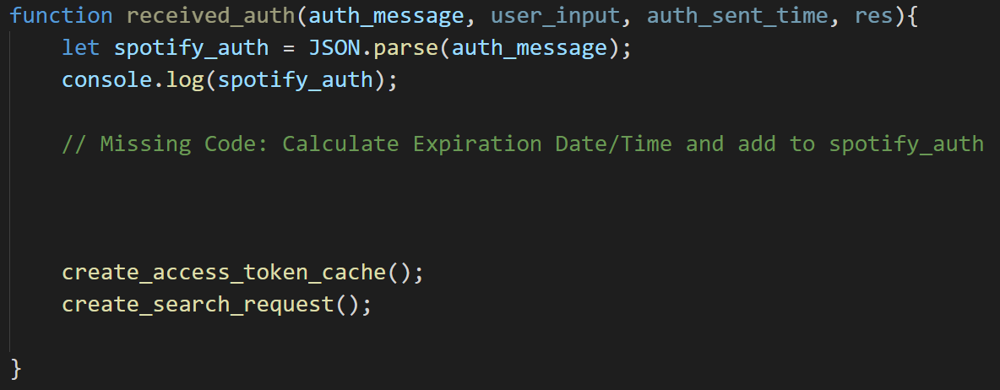

    

    Ignore the two functions `create_access_token_cache` and `create_search_req` for now.  You can write two empty function and fill them in in the next step.

    

14. Upon successfully sending the data, the response will include an `access_token`.  With this `access_token` the  Spotify API can be used for the next 3600 seconds.  Each time we query the API we should include the `access_token` in the request.  

    > Note this is how Spotify does authentication, not how all REST API's perform authentication. OAuth 2.0 is not a protocol, but a framework, implementation specifications are left to the API developer.  This means you as an application level developer need to learn the authentication specifications for each new REST API you want to include in your application.  Use an HTTP debugger to test all calls before translating each request to code.


### Token Expiration and Caching

This token expires in 3600 seconds after which a new token needs to be requested.  Our current code gets a new token every time though.  To reduce the overhead of requesting a new token every time, we will cache this token.

Caching is a term for saving previous requests and reusing the data as long as it is still relevant.  It is important when working with third party API's as most will have a rate limit to control how many requests can be made, and many paid API's will charge it's users per request.  If you can cut down your requests without impacting performance this can save you real world dollars.

The token generated is valid for 3600 seconds so we can save it for future requests instead of creating a new token every time.  There's a problem however, saving 3600 to a file won't work as once it's saved it won't decrease for every second that passes.  Instead calculate and save the **time** this token expires, and if the current time is after the saved value, fetch a new token.

The missing block above creates a new property `spotify_auth.expiration` and sets it to be one hour from `auth_sent_time` which was created earlier for this sole purpose. 

I used the following methods to generate the expiration property:

https://developer.mozilla.org/en-US/docs/Web/JavaScript/Reference/Global_Objects/Date

https://developer.mozilla.org/en-US/docs/Web/JavaScript/Reference/Global_Objects/Date/getTime 
(This function returns back milliseconds, make sure to convert from seconds)

https://developer.mozilla.org/en-US/docs/Web/JavaScript/Reference/Global_Objects/Date/toJSON

1. Generate the `spotify_auth.expiration` property and set it to be one hour from `auth_sent_time` 

2. Write a function `create_access_token_cache(spotify_auth)` that writes `spotify_auth` to a file `'./auth/authentication-res.json'` (Make sure to convert it to a JSON string, you cannot write objects to files)  Hint: `JSON.stringify()` will convert objects to JSON encoded strings

3. `fs.writeFile` is ideal for writing a cache.  

   https://nodejs.org/api/fs.html#fs_fs_writefile_file_data_options_callback

   The task of caching results can be accomplish asynchronously, because it only benefits future requests, the current request does not need the cache in any manner.  This is In contrast to the synchronous methods like `writeFileSync()` where we can not proceed until the write operation is completed.

   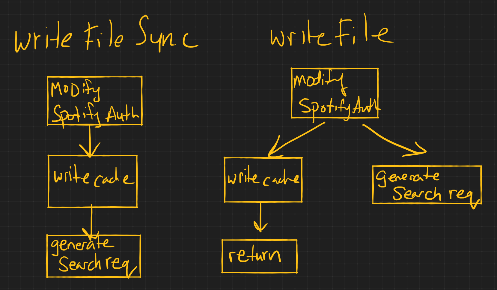
   
   
   
   You can use my code for checking to see if a cached file exists, but be prepared to write your own for the image cache.


   In my example `authentication_cache` points to the location of the saved cache.

   ```javascript
const authentication_cache = './auth/authentication-res.json';
   ```

#### fs.existsSync(path)

<https://nodejs.org/api/fs.html#fs_fs_existssync_path>

Notice we use `fs.existSync` over here.   There is an async version `fs.access()` but there is little reason to use it, because our program cannot do anything else in the meantime.  It has to decide which path to go down `create_search_request` or `received_auth` and it's decision is based on the contents of this file.

### Cache Independence

Make sure your code is not dependent on it's cache.  To test this, delete the `authentication-res.json` file and run your code.  It should request a new access_token and recreate the file `authentication-res.json`.


### Callback Hell

http://callbackhell.com/

Try to avoid nesting too many callbacks inside each other by modularizing your code.


###  /search (part 2): `create_search_request()`

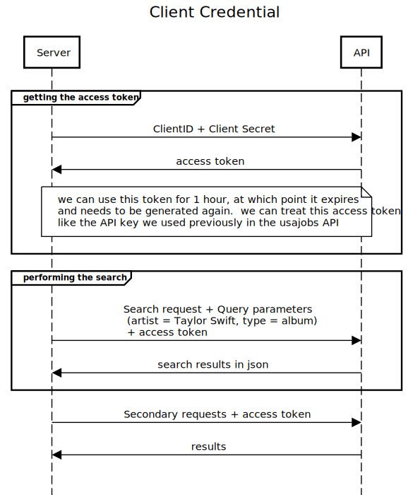

The next step creates another request to Spotify's API 

This time requesting album art related to the users search query

Here's the relevant Spotify documentation

https://developer.spotify.com/documentation/web-api/reference/search/search/

#### Endpoint

The endpoint is a communication channel that will process requests.  This tells us the protocol and the url that we send our requests to.

In this example this is using the `GET` method to the URL `https://api.spotify.com/v1/search`

Because this is a `GET` request and request parameters need to be attached to the URL instead of sent via the body with `res.end()` for `POST` request.  Because no data is being sent and `GET` is the default method we can remove options entirely and use the two argument version of `https.request(url,callback)`

https://nodejs.org/api/https.html#https_https_request_url_options_callback

 #### Request Parameters

Describes how to structure a requests.  In this example we need to supply `access_token`, `q`, and `type`.

* `q`: would be the artist name the user typed in
* `type`: hard code this to `album` since we are trying to get album art.
* `access_token`: Get from the `authentication-res.json` file

Use Insomnia to simulate a request for a search.  This request is a `GET` request which means embedded data goes into the query field (part of the URL)

You should receive back a larger JSON object this time representing the list of albums that fit the search term.  


Here's a cleanup version of the Spotify's `album` object structure.   We are interested in getting the album art images.  We get back a much larger object though so we need to navigate it's properties after parsing it.

The values that we need are the URLs of the album art.  The structure we wind up traversing through is:

`albums.items[n].images[0].url`, where `n` goes from `0` to `albums.length`.


Using the previous request as an example, write code to download this json file and print it to console.

### Downloading the Images


We need to download multiple images asynchronously.  (Refer to assignment-01 file system example for how to process multiple files asynchronously)  

Create a counter to keep track of how many images have finished downloading and once that number matches total albums, move to the final phase of serving a webpage.

For each image create a request to download the image at the url specified.

When receiving images don't use `stream_to_message()`, 
`body += chunk` has an implicit **string** conversion which doesn't work with binary data.  Instead create a file (using the original filename which is guaranteed to be unique, **don't rename it**) and `pipe()` the download to the file.  There's a specific `finish` event emitted when a Write Stream has emptied.

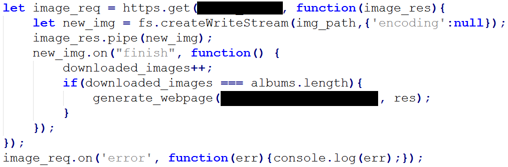


This syntax is slightly different, instead of using a `response` event listener like in the previous examples, you can put the `response` handler as the second parameter in `https.get()` or `https.request()`  This is slightly more compact, but increases the indentation complexity, combined with an inline function it can get messy fast.  Either choice is fine, I prefer using the observer pattern, but put this here to show a commonly used alternative.

I used `https.get()` in this example because it is a `GET` request, 
but you can use `https.request()` if you prefer
https://nodejs.org/api/https.html#https_https_get_options_callback


For writing the image `{'encoding':null}` prevents the system from encoding the data in `utf8` .  The event  `finish` is unique to Write Streams.  Read Streams use the event `end`.
https://stackoverflow.com/a/34310963/992856


### Serving a Webpage

After a write stream completes the `finish` event fires, increasing `downloaded_images` by one.  When it reaches `albums.length` call a function `generate_webpage()` 

The webpage for the results should display a heading (`h1`) with the text `Search Results` followed by the search query sent by the user.  It will then display an image (`img`) for each album art returned.


Refer to the `/ (root)` section on top of this document to see the basic HTML syntax.  You are essentially trying to generate a piece of text that looks like that, but with links to the 20 images you downloaded (don't point to the Spotify URLs, point to your cached versions, refer to `/album-art/` section on top to see the URL format, instead of using `localhost` use `./` to represent the current directory ) 


One way to do this is to collect all the local image paths after the `download_album_art` phase into an array of strings, apply a map function to wrap the results in `img` tags and then applied the `Array.prototype.join()` method to combine them.

<https://developer.mozilla.org/en-US/docs/Web/JavaScript/Reference/Global_Objects/Array/join>

Use `res.end()` to send the generated webpage to the client.

When the webpage loads it will make subsequent requests for the image in the image tag which we took care of earlier.  If the `/album-art/` path is setup correctly it should serve images which are then embedded into the webpage.


### Caching Images

Before downloading an image check your `/album_art/` directory to see if you have an image with the same filename and if so serve that instead of making a request to the server.

Use `fs.access()` to test for file existence.  Use this over `fs.existsSync` so we can check multiple files at the same time.

<https://nodejs.org/api/fs.html#fs_fs_access_path_mode_callback>

## Analyzing the Traffic

Using <https://sequencediagram.org/> create three sequence diagrams analyzing the Layer 5 traffic (Application Layer) for the following scenarios:

Do not include TCP level information like handshakes, SYNs or ACKs.

1. The first request to your server for artist A.
2. A second request (from the same user within one hour) to your server for artist B
3. A third request (from the same user within the same one hour) to your server for artist B again.

There should be three entities, Client, Server, and Spotify API  

Template for first request:


For large bodies of text use filename (eg. `index.html`) if available or describe data if unavailable

## Performance Improvements

We've cached the `access_token` and the album art images as part of this assignment.

There is something else we can cache, although this last cache has drawbacks.  Imagine that our goal was to minimize API calls at any cost however.

Discover what can be cached by looking at the sequence diagram and see the only remaining un-cached request to the API server, is it possible to cache this request such that if multiple users searches the exact same artist we don't need to query the API as often?

Implement this cache and show using an additional sequence diagram how it improves upon the current design.

What is the drawback to this cache?  What happens if an artist releases a new album?  How can we minimize the impact of the drawback?

## Testing

Delete all cached album art and `authentication-res.json` 

Search for the following terms:

* Taylor Swift
* P!nk
* Hear'Say
* AC/DC

Create a `console.log()` message inside the callback for each `https.request()` / `https.get()` make sure those messages are **NOT** being printed if you are using a cached resource (whether it be `access_token`, image, or something else).


## Further Reading

Environmental Variables

https://github.com/dwyl/learn-environment-variables