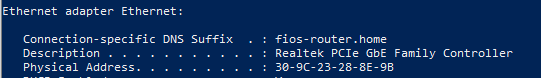
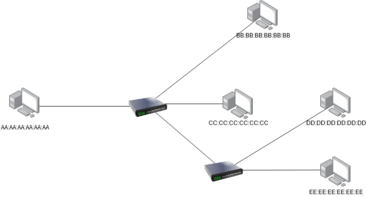
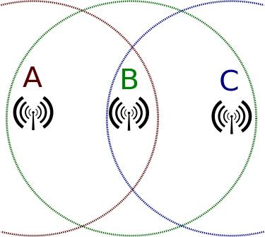

# Data Link Layer 

The Data Link Layer focuses on the node to node transfer of data between adjacent connections.  These networked nodes can consist of various devices like computers, routers, and switches.  

The data link layer is only concerned with providing transport from a single node to another node.  A higher layer protocol then chains together these short hops, to transmit messages across networks.  The data link layer abstract away the need for other layers to care about the physical layer and what hardware (whether it be twisted pair, fiber, or wireless) is in use.

In this example there are 4 independent data link layer exchanges necessary to send a message from Host1 to Host 2.

Within the OSI model, the data link layer can be further divided into two sublayers the Logical Link Control (or LLC sublayer) and the Media Access Control (or MAC sublayer).

## Media Access Control

The medium access control sublayer controls the hardware responsible for interaction with the wired, optical or wireless transmission mediums.  It translates data into signal.

When receiving signal from the physical layer, the Media Access control is in charge of converting that physical signal whether it be electrical current, optical light, or wireless radio frequencies into bits and arranging those bits into frames for the the Logical Link Control.  

It must also do this in the reverse.  When transmitting data the Media Access control receives a frame from the Logical Link Control and is in charge of converting that frame into a physical signal.  

## Logical Link Control  

On top of the Media Access Control sublayer is the Logical Link Control.

The LLC sublayer acts as an interface between the media access control and the network layer.  

1. It receives a message from an upper layer protocol (usually IP packet), 
2. chooses which network interface (or NIC) to send the data out on (for example on a laptop with both wireless and ethernet capabilities, ethernet is typically chosen by the operating system). 
3. If necessary it performs multiplexing, which is used to ensure multiple network layer protocols can coexist.  Multiplexing is the process of combining multiple signals from different sources into a single useable one.
4. Finally It wraps the message with the appropriate header, and sends it to the MAC sublayer to be sent out.
5. The entire process is performed in reverse when receiving a frame from the MAC sublayer.

The transmission medium will determine the required header.  The encapsulated packet is called a frame.

In modern applications there are two major family of protocols each with their own headers:

* 802.3 (Ethernet)
* 802.11 (WiFi)

Each of these protocols has had multiple iterations over their existence, with each upgrade changing a one or two letter suffix, for example 802.11 a/b/g/n/ac and more recently 802.11ax or more commonly referred to as Wi-Fi 6

Historically we also had a protocol specifically for fiber connections called [Fiber Distributed Data Interface](https://en.wikipedia.org/wiki/Fiber_Distributed_Data_Interface#Frame_format) (or FDDI, but it is now obsolete, replaced with Ethernet over Fiber)


### Why do we use frames?

In The next section we will go into the details of the Ethernet frame, but it's important to keep in mind on a high level how frames work and why we need them.  We've already mentioned that the Data link layer deals with the node to node transmission of data and that multiple exchanges are used in conjunction with a higher layer protocol to deliver packets across the Internet.

In order to get a message from one device to the next we need to specify additional information, for example who the sender is and who the receiver is.  This type of meta-information is what the frame is composed of.  It is just header information that is added by the LLC sublayer in order to ensure the delivery of a message from one node to the next.

At each hop along it's path the header information is discarded.  This is because the goal of the data link layer frame is completed once it arrives at the next device.  The information regarding where it's next hop will be, is stored one layer above inside the network layer header.  (We will come back to that in a later lecture regarding routing, so we can blackbox that for now)  Once it's chosen it's next hop, a new data link layer frame is then generated (whether it be Ethernet or 802.11) all the fields are recomputed using the current hardware device's properties.

This is for scalability reaso ns, our network may have hundreds or even thousands of devices connected together, but our frame size will always remains constant, no matter the number of hops required.

## Ethernet (IEEE 802.3)

The Ethernet frame is a family of frames that is used for wired connections, both copper and fiber.

It contains 6 or 7 fields with each frame separated by an interframe gap of 12 bytes for synchronization purposes.

We will be looking at the Ethernet II frame structure, but there are minor changes in the IEEE Ethernet standard used today which we need not concern ourselves with.


 * Preamble (8 Bytes)  

   The first 8 bytes of an ethernet frame are the preamble, which is a series of alternating 1s and 0s used to synchrnoize clocks (by detecting the transmission rate)

   ​	10101010 10101010 10101010 10101010 10101010 10101010 10101010 **10101011**
   
   * First 7 bytes are alternating 1s and 0s - used to synchronize clocks (by detect transmission rate)
   
   * The last byte of the preamble called the start frame delimiter (or SFD) has it's last bit changed to a 1,  to signals the start of next section
   
     


### MAC address

The next two fields are addressing fields.

Addressing on the data link layer is done via the MAC address. 

The MAC address is a universally unique field used to represent all devices in existence.

It is a 48-bit number (which gives us 281 trillion combinations).  Each network device is assigned a unique MAC address by it's manufacturer.  To prevent name collisions between manufacturers, each MAC address is composed of two parts, a 24-bit Organizationally Unique Identifier (OUI) followed by a 24-bit vendor assigned portion.  Manufacturer's of networking hardware coordinate with the IEEE, and are allocated blocks of OUI numbers, under the condition that each networking device has a unique MAC address.

>  It is possible to tell who manufactured a device by looking up it's OUI.

Open up powershell and type in

```powershell
ipconfig /all
```

If on mac type into terminal

```
networksetup -listallhardwareports
```




You are looking for a 48bit number called the Physical Address, typically represented as 6 sets of hexadecimal pairs separated by dashes or colons.  The first half of that number is the OUI, we can put that number into a search engine or OUI repository websites (like https://hwaddress.com/) to find the manufacturer of your network card.

In this example Micro-Star International was the creator of my Ethernet NIC.


Many devices will have multiple MAC addresses, if it supports simultaneous communication.  For example routers and switches will have a separate MAC address for each physical port that exists on the device.  A computer that can communicate via Ethernet and Wi-Fi will have separate MAC addresses for each networking card.  

You may also have one or more software based MAC addresses if you are running a virtual machine or VPN.

> In the past there were other addressing mechanisms on the data link layer (like DECnet), but as these addresses were assigned by hardware manufacturer's, having multiple competing standards was not a good idea and the MAC address became the standard format used by all data link layer protocols.


#### Special MAC Addresses

Most routing is unicast, where there is a single sender and receiver, but there are two special category of addresses:

* The Broadcast address allows a message to be sent to the entire local network.  The Broadcast MAC Address is the address with all it's bit's set to 1 or  `FF:FF:FF:FF:FF:FF`.  Any switch on the network that receives a frame containing the broadcast address as the destination will replicate and forward the frame to every other device on the local network and is used in discovery protocols like ARP

  

* 
Certain MAC addresses are reserved as multicast addresses or one sender to many recipients.  For those interested I've linked to a list of address ranges, but you won't be quizzed on specific values.
  
* https://en.wikipedia.org/wiki/Multicast_address#Ethernet
  

  
It is more important to understand how multicast works.  Multicast addresses allow devices to send messages to a subsets of the network.  This is done by configuring switches to accept or reject messages from a specified multicast address.  Upon receiving a message with a multicast address, they will only be forward it if the switch has been configured to accept messages for that specific multicast address. 
  
  

### IEEE 802.1Q

 * IEEE 802.1Q is an optional  (4 Bytes) field that provides support for VLANs and Quality of Service (QoS)

    VLAN stands for virtual LAN. 

    They address the problem of having complex networks where the physical topology (or connections) may not match the virtual.  

    With VLANs we can creating multiple private networks, that utilize the same physical network.  Imagine a company intranet with hundreds of people that work on different floors.  To ensure security, each department must have only it's members connected, but they may be spaced apart on different floors.

    VLANs lets you have multiple logical LANs operating on the same physical equipment. 

    When a message is designated for another device on the same VLAN, it will get tagged with a special VLAN header, any frame with a VLAN tag will only b e forwarded out of a switch interface configured to relay that specific tag.  Switches won't forward tagged messages to endpoints not configured to receive a specific VLAN tag. 

    

    This way you can have multiple virtual network that may operate using a single physical network. As an example you can have one VLAN for accounting and another for human resources.

    
    
    The standard also provides support for Quality of Service (or QoS) to allow your network to specify which VLANs will take priority should frames need to be queued or dropped entirely.  Voice over IP, competitive gaming, stock trading, and other time sensitive applications might be prioritized over file transfers.


### EtherType (2 Bytes)

Used to indicate which protocol is encapsulated in the payload of the frame

An EtherType value of:

* 0x0800 signals that the frame contains an IPv4 datagram.
* 0x0806 indicates an Address Resolution Protocol  (or [ARP](https://en.wikipedia.org/wiki/Address_Resolution_Protocol) frame which is a protocol used to bridge Data link and network layer, discussed later), 
* 0x86DD indicates an [IPv6](https://en.wikipedia.org/wiki/IPv6) frame  

### Payload (46-1500 Bytes)

This is the content that is being delivered, typically an IP packet.

### Frame Check Sequence (FCS)  (4 Bytes)

Provides Data integrity 

The FCS Uses a 32bit Cyllic Redundancy Check Algorithm (or CRC32)

https://en.wikipedia.org/wiki/Cyclic_redundancy_check

Before data is transmitted on the wire, it takes all the data and passes it through the CRC32 algorithm which produces a digest, this digest is then added to the frame.  

On the receiving end, the  CRC32 algorithm is run again on the received data, and the computed digest is compared with the one in the FCS.  If they don't match there was something corrupt and the packet gets dropped.

The frame check sequence only provides data integrity, there is no recovery aspect built into it, that is handled by a higher layer protocol.


## Switches

Now that we have a basic understanding of what is inside an Ethernet frame we can discuss switches in more detail.

A network switch is a data link layer hardware device that has the ability to inspect frames and forward them only to the applicable party and not the entire network.





In the following network diagram, if all the devices were connected via repeaters,  `AA:AA:AA:AA:AA:AA` transmitting to `BB:BB:BB:BB:BB:BB` would prevent `DD:DD:DD:DD:DD:DD` from transmitting to `EE:EE:EE:EE:EE:EE` as each signal would be duplicated to all endpoints at each repeater.  Without CSMA The messages that `B` and `E` receive would likely be corrupted.

The switch however is able to inspect each frame and forward it only to the physical port associated with the destination MAC address.

This ability to inspect the contents of the frame is what makes the switch a data link layer hardware device in contrast to the hub which is a physical layer hardware device.  In our next lecture we will introduce the router which is a network layer hardware device and as you may have guessed, can inspect the contents of the network layer packet.


Switches maintain a memory of attached devices called the Forwarding information base (FIB) or MAC Address Tables.  It stores each known device on the local network.  This table has four columns VLAN, MAC Address, Type (which can be either static or dynamic), and Physical Port.  The job of the Forwarding information base is to map MAC addresses to physical ports.  That way when a device wants to send a frame to a specified ethernet address the switch knows which port to send it out on.


> Port here refers to the physical connection on the switch.  (When we get to the Transport layer the term port is unfortunately used again, but they are unrelated.  To avoid confusion I will use the terms Physical Ports when referring to switches and Logical Ports when referring to transport layer sockets.


The switch uses the Destination MAC address in the frame combined with the MAC Address Table to look up the Physical Port, where it then forwards the message.  These forwards are chained together until the final destination is reached.


Example of a MAC Address table inside a switch 

```
#show mac address-table
          Mac Address Table
-------------------------------------------
Vlan    Mac Address       Type        Ports
----    -----------       --------    -----
   1    00ld.70ab.5d60    DYNAMIC     Fa0/2
   1    00le.f724.al60    DYNAMIC     Fa0/3
   
Total Mac Addresses for this criterion: 2
```


Switches learn about attached devices through two processes.  

When a frame is received, the switch will inspect the contents, and if the source address is not currently in the Forwarding information base, the MAC Address and physical port on which the frame was received will be added.


In this example we have two switches with empty MAC address tables

Machine A attempts to send a message to machine D.  The first step that the switch does upon receiving a message from A, is inspect the frame's source address and associated A's MAC address with the port `Fa0/4`  (Note port names are arbitrary and vendor dependent)


If a Switch receives a frame with an unknown destination address it uses a technique called unicast flooding to try and discover the device.  

A switch will make a request to all physical ports on the network to try to discover who owns the unknown MAC address.  Those who do not own the specified MAC address ignore the message.  


Other switches on the network will first check to see if they have a record for the specified MAC address in their FIB, and if it does, will send back the information, otherwise the intermediate switch will recursively unicast flood the request.  

The computer with the queried MAC address will send an acknowledgement.  Computers with different MAC address's will ignore the message.  If a response is received, each switch along the path will add the MAC Address and port used to it's Mac Address Table.

That is in order to get a message from A to D, the data must be first received on switch 1 using port Fa0/4, then forwarded off of port Fa/07, received on switch 2 using port Ga0/3 and forwarded out on port Ga/01.  Any future requests from A to D or D to A will be much faster now that there are entries for both devices in the MAC address table.


## Wi-Fi (IEEE 802.11)

802.11 or Wi-Fi operates in Half Duplex (Wifi messages are exchanged in Data + Ack pairs).  Wi-Fi can be extremely lossy depending on how far away the sender and receiver are  (possibly up to 10% loss and still usable).  This is generally what the number of bars or signal quality on your Wi-Fi connection is referring to.

Because of this large percentage of loss, the frame used for Wi-Fi are different than the one for Ethernet, it includes mechanisms for acknowledging the receipt of messages.

Each Wireless station will have a Service Set Identifier (SSID) used as the human readable name for a wireless access point, and a Basic Service Set Identifier (BSSID) which is the station's unique wireless identifier (or MAC address of the wireless station)

### Wi-Fi Frame

|                      |
| ------------------------------------------------------------ |
| *Image:* [Buhadram / Wikicommons](https://commons.wikimedia.org/wiki/File:802.11_frame.png) [CC BY-SA 4.0](https://creativecommons.org/licenses/by-sa/4.0/deed.en) |

* Frame Control (2 Bytes)

  ​	Defines the Type of frame: 

  https://en.wikipedia.org/wiki/802.11_Frame_Types

  Frames are broken up into 3 major categories, management, control and data.

  * Management frames assists in connecting and disconnecting devices

    They include:
  
  * Beacons: Which are continuously announced by wireless routers and include SSID, transfer rate, encryption
    * Probes: Laptops and phones remember connections they've used previously, so it can run through it's list of known networks and send probes out in order to automatically connect next time
  
  * Authentication: which are frames used to provide credentials to show they are an authorized user
    * Association: Once authentication is complete, mobile devices can associate with a wireless access point to gain full access to the network, frames used in this context are categorized as association. 
  
  * Control: Assists in the delivery of messages and are necessary due to the half duplex nature of Wi-Fi
    
    * ACKs: Acknowledges receipt of data
    
    * Block-ACKS: Acknowledges receipt of multiple chunks
    
    * RTS and CTS: 
    
    Request to send and Clear to Send
    
    Both of these signals ar e used to combat the hidden node problem 
    
    #### Hidden Node Problem
    
    
    
    In the hidden node problem there are three actors A,B, and C.  A and C can interact with B, but do not receive each other's messages.  The half duplex nature of Wi-Fi means that collisions can occur if both try sending at the same time and data is loss in these cases.  Is there a protocol that minimizes thi s loss?
    
    In RTSCTS, devices send RTS requests and wait for a CTS response, if it receives a CTS message that is designated for a different device, it will assume that someone else is using the network and wait a random interval before sending another RTS.  This is the same algorithm (Carrier sense multiple access with collision avoidance) we discussed in the first lecture used by network hubs in the 1970.  
    
  These type of algorithms can be used in any half-duplex situation.
    
  
    
    * Data : Contain the payload

|  |
| ---------------------------------------- |
|                                          |


* Duration (2 Bytes)

  * Duration: Used by the sending radio to specify how much time it is reserving when waiting for pending acknowledgment frame.

### MAC Address

There are four MAC address fields on each 802.11 frame.  

The Last two are optional and depend on the type of frame 

* Address 1: The receiver, is the device that decode the radio waves.  This is often the destination, but that is not a required.  This address can be broadcast or multicast address in which Address 3 is checked upon receiving the packet.
* Address 2: The transmitter, i s the device that sends the radio waves. this is required in order to send acknowledgements.
* Address 3: Used for filtering devices when using multicast or broadcast addresses, they ignore messages from BSSIDs that they are not a part.
* Address 4: Used for Wi-Fi bridging (not discussed)

---


* QoS Control + HT Control: Used to prioritized traffic (Again VOIP, competitive gaming, stock trading are both time sensitive activities and you might want to prioritize that traffic over a file transfer)

* Sequence Control (2 Bytes) - Used for authentication (not discussed)

* Payload (0-7951 Bytes)

* Frame Check Sequence (FCS) 

  The same (4 Bytes) used in the ethernet frame to provide data integrity

  It also uses the CRC32 algorithm


Our next topic will be the network layer where we will learn how millions of messages are routed from our local machines to a server possibly thousands of miles away, all in a few seconds.


### Additional Reference:

* https://witestlab.poly.edu/blog/802-11-wireless-lan-2/
* https://www.oreilly.com/library/view/80211-wireless-networks/0596100523/ch04.html
