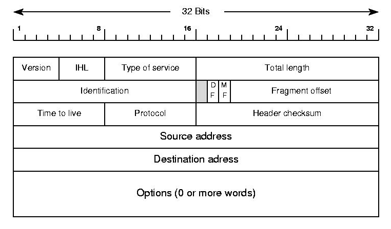

# Network Layer

The Network Layer provides support for internetwork communication.  It facilitates packet forwarding and routing between devices on separate networks and enables end to end communication.  Our discussion of the network layer will be split into two parts, in this first lecture we will discuss the architecture of the Internet, how routers work, the Internet Protocol, and the structure of the IP packet.


In the following lecture we will look into various routing protocols, which dictate the rules that routers and autonomous systems follow, on how to forward packets such that they reach their final destination as efficiently as possible.  We talk about shortest path algorithms like Dijkstra and Bellman–Ford and how they are used to route traffic.


The consequences of doing the lectures in this order, is that, during this lecture you will have to assume that each router knows the best path to forward packets to and this entire process is efficient.  More concisely, if we are sending a message over the Internet from computer A to B, at each router we can use an "oracle" to determine which router will be the next hop.  The details about this "oracle" algorithm will be revealed in the next lecture as well as it's runtime complexities.


## Local Area Network (LAN)

A local area network (or LAN) is a grouping of computers that are interconnected within a single physical network.  Typically devices on a LAN can easily communicate with each other, but require special configuration in order to communicate with devices outside the local network.  Networks are separated by routers, a single network may have multiple routers each acting as a gateway between other networks.

If the topology of multiple connected networks is known beforehand, and we have the MAC addresses of all intermediate nodes, this can be done solely through the data link layer through the use of network bridges which are devices that connect two or more LANs.  Even with routers in play, if we control the entire network we can communicate using just the data link layer.

When using the Internet though, we need to be able to communicate with devices that we don't own and are connected to routers that we have no control over.  The network layer facilitates delivery of these messages by getting us closer and closer to the final destination one hop at a time.

IPv4 a network layer protocol, facilitates communications between networks that are not known beforehand.


## Internet Protocol (IPv4)

The most widely used protocol on the network layer is the Internet Protocol (abbreviated IP) It has two versions, IPv4 and IPv6.  Other protocols like ICMP also exists, but is mainly for error reporting purposes and it's header is largely the same as an IP datagram with a few additional fields.

Before your computer sends a message off to the Internet it attaches an IP Header to it, this header for the most part stays the same at each hop along the path (certain values like TTL are decreased, but the address fields are maintained).  This is contrast to datalink layer protocols like Ethernet and 802.11 where the frame headers are removed at each hop.


This IP Header contains multiple fields, the most important of which is the Source and Destination address.

### IP Addresses

Addressing in IPv4 is done with IP addresses.  Each device connected to the Internet is identified by this IP address.  These IP addresses are leased to individuals by Internet Service Providers (or ISPs)  

Your monthly Internet bill includes payment for a temporary lease of an IP address from your ISP's pool of available addresses.  You are not guaranteed the same IP address each time unless you pay for business class Internet that includes a static IP.  


> ISPs in recent years have sent legal warnings to its users for illegal sharing of copyrighted material.  But how do they know who was sharing files if the IP addresses are shared?
>
> The complaints are sent from the copyright holders to ISPs, and include not just the IP address that were used and the files that was shared, **but also the timestamp of when the files were being uploaded**.  From there the ISP can identify what user was using that IP during that window of time to catch the culprit.


IP address are a 32 bit number composed of four octets.  Each octet is typically represented as a number from 0 to 255 separated by dots (Eg. 192.168.0.0 or 255.255.255.255).  This format is called dotted decimal notation. 

Due to IP addresses being a 32-bit number there is upper limit of 2^32^  or 4,294,967,296 addresses.  While enormous at the time, the wide adoption of the Internet has caused these numbers to quickly deplete.  By January 2020 all IPv4 addresses have been allocated between various ISPs around the world.  This is called the IPv4 Address Exhaustion Problem.


IP Addresses are composed of two parts, a network component and a host component.  The network component uniquely identifies a network, while the host component allow all devices on that network to share the same prefix.  By decreasing the number of bits used in the network component, those bits are automatically shifted to the host component, allowing for a single network to to have more devices. The cost of this is that there are fewer unique networks allowed on the Internet.


#### Classful Addressing  (Historical)

Originally these network addresses were divided into network/host components at every 8 bits (called an octet) creating 3 classes of addresses.

* Class A: *(1 octet for network, 3 octets for host)*

  Allowed for (2^24^ - 2) or 16,777,214 devices per network

  Identified by first octet in the range 0-126

* Class B: *(2 octet for network 2 octets for host)* 

  Allowed for (2^16^ - 2) or 65,534 devices per network

  Identified by first octet in the range 128-191

* Class C: *(3 octet for network, 1 octet for host)* 

  Allowed for (2^8^ - 2) or 254 hosts
  
  Identified by first octet in the range 192-223


> There were also Class D and Class E addresses reserved for multicasting and future use.
>
> * Class D: Start with bits 1110.  Used for multicasting [Begins with 223-239]
> * Class E: Unassigned [Begins with 240-255]


The drawback to this system was that because there were only three rigid sizes of IP address blocks, small companies could outgrow their allocated class C address and their only option, would be to either get another class C address and combine them (but this would create two separate ranges of IPs for a single organization) or upgrade to a Class B address, giving them 256 times as much address space as they had previously had.  This would also happen for Class B addresses that wanted more host, with the added complication that there could only ever exist 126 class A addresses.


#### CIDR - Classless Interdomain Routing

In modern applications we use Classless Interdomain Routing (or CIDR).  

In CIDR instead of an entire octet (8 bits) being changed at once, a single bit is moved from the network to the host.

When using CIDR, IP addresses have two forms:

1. one to identify the network (called the CIDR address)

   which include a network portion, a host portion, and a subnet identifier.

   **64.64.0.0/20**

   01000000 . 01000000 . 00000000 . 00000000	 (converted to binary)

   

   The first 20 bits in this case represent the network portion.

   The remaining 12 bits are used for hosts.

   This network can have 2^12^ - 2 hosts.  (There are two reserved addresses for each network: the host address of all 0's is reserved to identify the network, the host address of all 1's is reserved as a broadcast address)

2. ones for individual hosts

   **64.64.5.5** 

   The key difference is the lack of a subnet identifier, when sending messages to individual machines, we do not care about how IP addresses are allocated, all we care is that the address is unique.


CIDR fixes the allocation problems of Classful domain routing:

Networks looking to add more hosts could exchange their existing CIDR address for an available address with one bit shifted over.

* Return: **64.64.0.0/20**
* Get Back: **80.80.0.0/19**

Because the network portion has been reduced by a single bit, this network can have twice as many hosts while ensuring all devices on the network share the same network prefix.


#### Reference: Subnet Masks

Another way to represent a network address, used in older devices is to use a subnet mask, which adds an extra column that would have binary `AND` applied to the address to extract the network portion.


**CIDR Notation:**

64.64.0.0/20

**Subnet Mask Notation:**

| IP Address | Subnet Mask   |
| ---------- | ------------- |
| 66.64.0.0  | 255.255.240.0 |

255.255.240.0 written in binary is   11111111 . 11111111 . 11110000 . 00000000 
which identifies 20 bits for the network.


Personally I find this mask notation is confusing in contrast to CIDR notation.


### IP Packet Structure


The protocol data unit of the IPv4 protocol is the IPv4 Packet also called IPv4 Datagram.

This header wraps our payload, and gets rewrapped with a data link layer header before being transmitted.



* **Version** (4 bits) - determines which version of IP this packet is using

* **IHL** (4bit) - Internet Header Length (Typically 20 bytes for IPv4)

  If we ignore options in the above diagram we can see we have 5 rows of 32 bits, and with 8 bits in a byte that totals 20 bytes for the header.

* **Type of Service** - Specifies data about QoS technology.

* **Total Length** - Specifies the length of the entire packet. (Maximum size 65535)

  

  The next row deals with fragmentation of packets, should a particular packet exceed the  maximum transmission unit (MTU) of a link, that packet will need to be fragmented before it is sent.  Packets are reassembled at their final destination.

  

  

  

* **Identification** - (16 bit) - Used to group messages together.  (When IP messages are fragmented this field is used to put back messages together.)

* **Flags** (3 bits) - The first bit is reserved and is always 0.  The second bit **(Don't Fragment)** indicates if a datagram is allowed to be fragmented and the last bit **(More Fragments)** indicates if there are more fragments.

* **Fragment Offsets** (13 bits) - If a packet is fragmented this helps sequence packets by indicating to the recipient device where in the overall message each particular fragment should be placed.


> When an MTU requirement forces a datagram to be fragmented, it is split into several smaller IP datagrams, each containing part of the original. The header of the original datagram is changed into the header of the first fragment, and new headers are created for the other fragments. Each is set to the same *Identification* value to mark them as part of the same original datagram. The *Fragment Offset* of each is set to the location where the fragment belongs in the original. The *More Fragments* field is set to 1 for all fragments but the last, to let the recipient know when it has received all the fragments.
>
> http://www.tcpipguide.com/free/t_IPMessageFragmentationProcess-3.htm


**TTL** - Time to Live (8bit) How many router hops a datagram can traverser before it's discarded.  (Used to prevent loops when there is a misconfigured router)

Without the TTL it is possible for a misconfigured router to cause a packet to stay on the wire forever forwarding messages such that it eventually comes back to itself.  The TTL decrements after each hop and when they hit 0 the packet is dropped.  The default TTL is 64.


**Protocol** (8bits) Determines the transport layer protocol.

**Header Checksum** - A checksum of the entire header field.

**Source IP Address**: IP address of sender

**Destination IP Address**: IP address of recipient

**Options** - Used for testing purposes. (Rarely Used)

**Padding** - because the options field is variable in length the unused options are padded with zeros to ensure the correct size.


## How Routers Encapsulate and De-encapsulate data

When a router receives an IP packet, first it will see if the incoming packet's destination address is for a host on it's own network and if it is the router makes the final delivery.  

Otherwise if the destination address matches a network CIDR range in it's routing table, it will forward the message to the next router out on a specified Interface.  We will go into the details of how the routing table is populated in our next lecture.


All routers are configured with a special catch all entry called the default gateway (which is typically your ISP) which is an IP address to forward messages to in the event that no other forwarding rule applies.


At each hop the router receiving the packet will decrease the TTL (and drop the packet if that value hits 0),  Look up the next hop in it's own routing table and then perform fragmentation if necessary before sending the data to the next hop.  

At each hop a new data link layer header is appended to IP packets.  This data link layer header is discarded after each hop as the data link layer only facilitates delivery across a single hop.  In contrast the network layer header is discarded at it's final destination because the network layer facilitates end to end delivery of data.

Routers are considered network layer hardware because they inspect the destination IP address in each packet before making a decision on what network to forward the request to.


> Exercise: Explain how a message is delivered from machine A to machine C, assuming they have no idea of the network topology outside  of their directly adjacent neighbors.

## Reserved IP Addresses

There are several IP ranges that are not to be allocated to any entity.  These addresses are used locally, the three that we care about the most are 127.0.0.0/8 which allows us to communicate with ourselves, the range 192.0.0.0/24 which allows us to communicate with other devices on our private network and 224.0.0.0/4 which is used for multicasting.

| Address Block | Range                     | Devices     | Scope           | Description                                                  |
| ------------- | ------------------------- | ----------- | --------------- | ------------------------------------------------------------ |
| 127.0.0.0/8   | 127.0.0.0–127.255.255.255 | 16,777,216  | Host            | Used for [loopback addresses](https://en.wikipedia.org/wiki/Loopback_address) to the local host. |
| 192.0.0.0/24  | 192.0.0.0–192.0.0.255     | 256         | Private network | IETF Protocol Assignments.                                   |
| 224.0.0.0/4   | 224.0.0.0–239.255.255.255 | 268,435,456 | Internet        | In use for [IP multicast](https://en.wikipedia.org/wiki/IP_multicast). |

More:

* https://en.wikipedia.org/wiki/Reserved_IP_addresses


## Multicast


IP Multicast uses a *one-to-many* association where datagrams are routed simultaneously in a single transmission to multiple recipients. 

* PC Cloning / Software Updates
* VOIP / Video Monitoring / Conferencing, 
* Streaming (Video Surveillance)	

Video surveillance systems are probably the most common usage with many CCTV's broadcasting on a specific IP address that you can navigate your browser to watch.  Because these are local IP addresses, multicast traffic will never leave your network.  A server only needs to send the message once and all registered devices will "listen" in on a specified IP.


### Local Area Networks

Your home network can have up to 256 devices in the the address block 192.0.0.0/8.  When a device connects to your home network it is temporarily allocated one of these addresses through a process called DHCP.


> **Food for thought** - When we purchase Internet service for our home, we are leasing a single IP address from our ISP.  This IP is shared between all devices on our home network.  When sending data out, there is no problem, but what about when a request comes in to our network, which device gets that message if they all share the same IP?
>
> We actually don't have enough information to solve this yet: we will come back to this question after discussing the transport layer.


## Dynamic Host Configuration Protocol (DHCP)


The DHCP algorithm has 4 stages:

1. DHCP Discover - A discovery is request is broadcast on the network and includes the devices MAC address.
2. DHCP Offer - All DHCP servers who receive a request and have an available IP address, offer to lease the IP address to the newly connected device.
3. DHCP Request - The newly connected device sends a DHCP request to the server of the first response they receive.  When receiving multiple offers, it assumes the first offer has the smallest latency.
4. DHCP Acknowledgement - Upon receiving the DHCP request, the DHCP server creates a record in it's DHCP table to keep track of which local IP addresses were in use.  Then it sends an acknowledgement which includes additional information like expiration.


### Dynamic IP

IP addresses assigned with DHCP are designated to be dynamic IP's.  Dynamic IPs revert back to the DHCP server once the expired.  

They are useful for devices that don't need to communicate with other local devices. (like desktop / laptops)

You can have multiple DHCP servers as long as they use seperate pools of non-conflicting local IP's for instance configure DHCP Server 1 to assign IP addresses in the range [192.168.0.1 to 192.168.0.127] and DHCP Server 2 to assign assign IP addresses in the range [192.168.0.128 to 192.168.1.254]


### Static IP

We can also go into the router settings to configure static IP addressing.  Unlike DHCP static IP addressing does not expire unless revoked.  They are useful for devices that others may want to connect to (like a network printer)

This is because DHCP will automatically assign any newly connected devices an IP from it's available pool, there's no guarantee that device will get the same IP address.  When using a network printer, we are sending the print job to an IP address.  Should the IP Address of that printer change because DHCP gave it a new one, we may wind up sending our print jobs to the wrong location..


### No Persistence

IP addresses belong to networks not to the devices attached to those networks.  Devices lease an IP using the DHCP protocol.  This is contrast to MAC address which is unique per device, and always stays the same, regardless of the network it's connected to.

Each computer connected to a network is leased a local IP address, this address is unique to the network, but can be reused outside of the network as it is a reserved address.


## ARP

The address resolution protocol (ARP) is used to map a known IPv4 address to  an unknown MAC address.  It cannot be used outside of local networks.  

ARP is the protocol used to map IP addresses to MAC addresses.

Data Link layer Protocol used to discover the hardware address of a node with a given IP address.

All network devices will keep a ARP table, a list of IP addresses and the MAC addresses associated with each device.  ARP table entries expire after a short period of time to ensure network changes are accounted for.


If you run this in Windows you can see your local ARP table. 

```
> arp -a

Interface: 10.0.75.1 --- 0x7
  Internet Address      Physical Address      Type
  10.0.75.15            ff-ff-ff-ff-ff-ff     static
  224.0.0.251           01-00-5e-00-00-fb     static
  224.0.0.252           01-00-5e-00-00-fc     static
  255.255.255.255       ff-ff-ff-ff-ff-ff     static

Interface: 192.168.1.151 --- 0x11
  Internet Address      Physical Address      Type
  192.168.1.1           c8-a7-0a-b7-09-f9     dynamic
  192.168.1.255         ff-ff-ff-ff-ff-ff     static
  224.0.0.251           01-00-5e-00-00-fb     static
  224.0.0.252           01-00-5e-00-00-fc     static
  255.255.255.255       ff-ff-ff-ff-ff-ff     static
```


### Broadcast ARP Request / Response

When trying to associate a given IP address to an unknown MAC address, devices will send an ARP message to the network asking for the device currently owns the specified IP address to respond.


## Final Thoughts

In this lecture there was a key assumption that we made, that our routers already know the best path to get our message delivered.

In our next lecture we will discuss routing protocols which populate our router's memory (called  a routing table) with CIDR addresses and how it keeps those records up to date with a constantly changing Internet.


