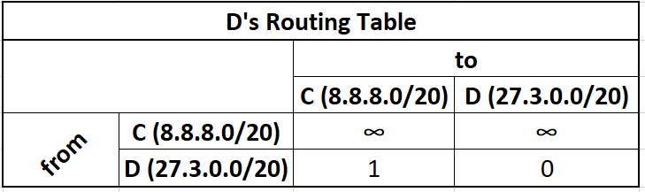

# Routing

In our previous lecture we introduced the Internet Protocol, and described on a high level how traffic gets wrapped in an IP header, before being forwarded from one router to the next.

We relied on a major assumption, that routers know how to efficiently decide which outgoing port to forward traffic on, such that we minimize the total end to end transmission time.  In this lecture we will be looking at various routing protocols, their underlying algorithms, and how networks share connectivity information with each.


## Autonomous System (AS)

An Autonomous System (or AS) is a collection of networks owned and operated by a single entity using a unified routing policy. This may be an ISP, a content provider, a university, or other large network provider.

The routing policy includes which IP ranges the AS controls, as well as a list of other AS's to which it's connected to.  This routing policy dictates how routers control and filter which routes it advertises to neighboring nodes.


## Interior vs. Exterior Routing Protocols

Protocols that communicate within a single AS are called Interior gateway protocols.  Protocols that communicate between different AS's are called exterior gateway protocols.  

**Interior Gateway Protocols:**

* Routing Information Protocol (RIP) [Historical]
* Open Shortest Path First (OSPF)
* Intermediate System to Intermediate System (IS-IS)

**Exterior Gateway Protocols:**

* Border Gateway Protocol (BGP)

Our discussion will be centered around Interior Gateway Protocols.

Exterior Gateway Protocol's have added complexities like trust and traffic management.

## Routing Tables

Each router will have a reserved memory to store it's routing table.  This routing table will be initially empty, but will be populated overtime.

To get an idea of the structure of a routing table you can look at your local machine's own routing table by typing into a terminal:

```bash
netstat -nr
```

This information displayed will likely only have a single external interface 0.0.0.0/0 which directs all external traffic, to your default gateway (Your ISP).

Your ISP's router will have many more records including this special catch-all entry.  This is used when encountering unknown IP addresses, sending the request to a higher tiered ISP.  ISP's are tiered from 3 to 1.  With tier 3 ISP's being the smallest, typically referred to as last mile providers.  In contrast tier 1 providers form the backbone of the Internet and are connected to all other networks via settlement-free peering, and thus are guaranteed to know who is in charge of a given IP  address.

This routing table will have at minimum three columns:

* Destination network: IP address range that is known to the router.

  * In IPv4 for legacy reasons most operating systems display the information using Destination + Subnet Mask Notation, this has been switched to CIDR notation for IPv6.

* Interface: Endpoint to send data on to reach the next hop

* Metrix - Determines how routing algorithms choose between two different paths

  * **RIP**: hop count

  * **OSPF**: Dynamic based on the connection speed (will periodically check connection speed to calculate OSPF cost)

    ```
    Bandwidth 	OSPF Cost
    100 Gbps 	1
    40 Gbps 	1
    10 Gbps 	1
    1 Gbps 		1
    100 Mbps 	1
    10 Mbps 	10
    1.544 Mbps 	64
    768 Kbps 	133
    384 Kbps 	266
    128 Kbps 	781
    ```

  * **IS-IS**: each link has  a default cost of 10 with the ability to manually adjust for specific connection.  This is effectively the same as hop count, but with the option to adjust the weights of links.


## Shortest Simple Path Problem

The shortest simple path problem looks to find a path between two nodes in a graph without any internal loops such that the sum of the weights of its edges is minimized. 

You should already be familiar with Dijkstra's Algorithm from CS313 which solves the problem in O(|V|log|V| + |E|) time.


Dijkstra Algorithm uses a priority queue to order all it's candidate routes by the total cost as it expands out from the starting node.  As it relaxes each route, new nodes are reinserted into the priority queue based on it's cost from the starting node.  When we reach the final destination, we have the shortest path.

If you need a refresher on Dijkstra I'd recommend watching these two video before proceeding.  I'll specifically be using the same relaxation definition from the second video at timestamp 5:55 when discussing distance vector algorithms.

https://www.youtube.com/watch?v=GazC3A4OQTE

https://www.youtube.com/watch?v=2E7MmKv0Y24


### Dynamic shortest simple path algorithms

The Internet problem is not a graph though, it is a dynamic graph.  Nodes and edges are constantly changing.  The original reason for choosing Bellman-Ford over the more efficient Dijkstra was due to Dijkstra's requirement of needing full information about the graph beforehand, which at least historically was expensive memory-wise and something to consider.  In contrast Bellman-Ford can learn about the graph as it's running.

Both Distance Vector and Link State Routing Protocols are algorithms that run continuously on routers due to the nature of the problem being dynamic.  The actual forwarding requests are executed instantaneously using a simple lookup of the best route known at the time when the request is made.  When we measure complexity of the algorithms, the term convergence is used when referring to the number of steps necessary to propagate a change across the entire Autonomous System.


## Distance Vector Routing Protocol

The distance vector routing protocol is a class of routing protocols that are based upon the Bellman-Ford algorithm.


### Bellman-Ford Algorithm

Bellman-Ford is a Shortest Path algorithm that operates in O(|V|*|E|) time.

Bellman-Ford calculates the shortest distance from a starting node to every other accessible node on the graph.


#### Bellman Ford Equation


To find the shortest path from x to y:

For each vertex v connected to x:

* calculate how much it costs to go from x to v (take 1 step), 
* then calculate the shortest cost from v to y recursively
* add the two together

Choose the vertex with the smallest sum.

#### Relaxation

Bellman-Ford uses the same relaxation technique used in Dijkstra.  

Relaxation involves expanding all the paths of selected vertices, keeping track of total edge costs.  Bellman-Ford is an iterative approach that keeps track of the shortest paths to each candidate node by checking to see if new routes reduce the total cost to reach a specific node.


In this example going from S to E.  We can relax vertex A to create a cheaper path from S to E (5 down to 4).  By relaxing both A and B we can find the optimal path of 3.

How does this differ than Dijkstra and what makes Dijkstra more efficient?  

The main difference between the two algorithms is in how they choose which vertex to process next.

Bellman–Ford differs then Dijkstra in how it chooses to expand paths.  In Dijkstra we use the priority queue to relax only the vertex with the smallest cost.  In Bellman-Ford we expand every possible vertex.  We stop this relaxation process after |V|-1 steps, performing anymore would guarantee a loop.  

> Consider a linked list structure, this would require |V|-1 relaxations in order to get from S to E.  If we needed to apply one more relaxation after that, that would mean there was a loop internally somewhere.

In each of these iterations,  the number of vertices with their shortest path cost, correctly calculated grows, from  which it follows that eventually all vertices will have their correct shortest path.

Due to the scale of each AS and the number of networks under their control, we may not have the ability to process every possible path.  Even if we don't get the absolute shortest path, with a few iterations we should have a close approximation of where the next hop should be.

In the previous example with only 1 relaxation pass we optimized the path cost down from a cost of 5 to 4.  If we immediately received a request to go to E, we may not have the best possible path,  we can give a "good enough" answer back right away, and continue to update our routing table.

This is true in practical applications as large AS's typically have multiple highly connected "backbone" routers used for the purpose of ensuring that routing information gets quickly propagated to satellite routers. 


### Distance Vector Algorithm

In the distance vector routing protocol, 

Routing tables are initialized with the IP Network Addresses of devices that they are directly connected to.  We assume each network knows it's own address and the cost to reach it's directly connected neighbors.

Periodically, (in RIP every 30 seconds) routers share a digest of their routing table containing the best known path to each known network.  This digest is called a distance vector.

Each network does not need to know the existence of nodes it is not directly connected to, additional discovered networks can be added as the protocol runs.

Upon receiving new distance vectors, each router will update their routing table using the Bellman-Ford equation.  This protocol of sharing distance vectors and updating routing tables runs continuously on each router to quickly be able to accommodate network changes.


A's initial routing table:


A's initial distance vector

```
Network Address     Metric        Interface
  6.6.6.0/24           0            A->A
  7.7.7.0/24           1            A->B
  8.8.8.0/20           4            A->C
```

B's initial routing table:


B's initial distance vector

```
Network Address     Metric        Interface
  6.6.6.0/24           1            B->A
  7.7.7.0/24           0            B->B
  8.8.8.0/20           1            B->C
```

C's initial routing table


C's initial distance vector

```
Network Address     Metric        Interface
  6.6.6.0/24           4            C->A
  8.8.8.0/20           1            C->B
  8.8.8.0/20           0            C->C
 27.3.0.0/20           1            C->D
```

D's initial routing table



D's initial distance vector

```
Network Address     Metric        Interface
 27.3.0.0/20           0            D->D
  8.8.8.0/20           1            D->C
```


These initially look the same, but the routing table will be populated with the routing table of other vertices filling in it's 2-Dimensional table, while the distance vector will only be a 1-Dimensional projection of the "best" known routes from itself to any given network.


For simplicity we abbreviate all CIDR addresses as just ABCD.  The computed distance vectors are in colors.  These distance vectors are computed, then shared with neighbors.


Upon receiving a distance vector, routers updates their routing table with the new information, following the Bellman-Ford equation and then the process restarts, with each router computing a new distance vector to be shared with all it's neighbors.  


**Lets say that router A receives B's distance vector:**


We first update our row reserved for B's information. (yellow)

Using the Bellman Ford Equation


Network B can route traffic to A,B, and C.

We take B's distance vector, add the cost to get to B (green), and if that cost is smaller than my current best path we update our routing table.

From B we can get to A with a cost of 1.  It costs us 1 to get to B, so the total cost is 2.  Previously, we can get to A with a cost of 0, so we do not update our table.

From B we can get to B with a cost of 0.  It costs us 1 to get to B, so the total cost is 1.  Previously, we can get to B with a cost of 1, so we do not update our table.

From B we can get to C with a cost of 1.  It costs us 1 to get to B, so the total cost is 2.  Previously, we can get to B with a cost of 4, the new cost of 2 is cheaper so we update our routing table.


We record the data even if it generates a worst path, because of the dynamic nature of our problem.  Should a link no longer be available or become slower due to degradation, we don't want to keep stale data.  Instead we record all the received data and in the next step we choose which path to take.


**Next let's say that router A receives C's distance vector:**


Network C can route traffic to A,B, C, and D.

A just learned the existence of D and will add a new row and column for it.

We take C's distance vector, add the cost to get to C (green), and if that cost is smaller than my current best path we update our routing table.

From C we can get to A with a cost of 4.  It costs us 2 to get to C, so the total cost is 6.  Previously, we can get to A with a cost of 0, so we do not update our table.

From C we can get to B with a cost of 1.  It costs us 2 to get to C, so the total cost is 3.  Previously, we can get to B with a cost of 1, so we do not update our table.

From C we can get to C with a cost of 0.  It costs us 2 to get to C, so the total cost is 2.  Previously, we can get to C with a cost of 2, so we do not update our table.

From C we can get to D with a cost of 1.  It costs us 2 to get to C, so the total cost is 3.  Previously, we can get to D with a cost of ∞, the new cost of 3 is cheaper so we update our routing table.


The bottom row will stay as infinity unless we get connected to D directly.

> Exercise 1: Repeat the previous example, but assume A receives C's distance vector first followed by B's.  Do we get the same result?


This process then restarts with every router recalculating a new distance vector based on the cheapest known path.  It then sends this out to all it's neighboring routers.


It's also important to note that we only examined a single router A.  This algorithm is distributed.  Networks B,C, and D are also updating their routing table at the same time.

Unlike the Bellman-Ford algorithm which operates on static graphs and completes in |V|-1 passes, in dynamic graphs, this runs forever as networks can change at anytime.  New vertices and edges can appear and disappear or change their weights.  Bellman-Ford is useful as these changes converge quickly.


### Count to Infinity Problem (Reference)

>  Failures travel slow

Running Bellman-Ford forever creates a new problem as the original algorithm assumed that we would stop after |V|-1 steps. 

The count to infinity problem occurs when we lose connectivity or a link becomes slower.

The effected vertices looks for a different path, but due to how the Bellman-Ford equation is defined, it may choose a path that would route back through itself using the old weight of an edge that is no longer valid.  It does this because distance vectors only share the cheapest cost to other nodes without any context of the route.

Each router will update it's routing table adding the cost to navigate through each other, effectively bouncing between two networks until the true path becomes more cost effective. 

> Example: Hey the cost from A to B has jumped from 2 to 50, but it looks like there's a path from C to B, that only costs 4 and the cost from A to C is 2, we can update our cost to 6.
> 
>It does this not knowing that, that path cost of 4 was calculated based on the path C to A to B using the previous values of A. On the next iteration the cost is increased by 2 and sent right back.  This back and forth exchange repeats until we finally reach 50.


<iframe height="720px" width="1280px" src="https://www.youtube.com/embed/_lAJyA70Z-o" frameborder="0" allow="accelerometer; autoplay; clipboard-write; encrypted-media; gyroscope; picture-in-picture" allowfullscreen></iframe>


## Link-state routing protocol

In addition to the count to infinity problem, Distance Vector protocols are also slow to react to changes far away, because vertices only send messages to neighbors, which must then wait one cycle before sharing with their neighbors.

Due to improvements in hardware since 1970, we are no longer bound by memory and computational limitations that made Distance Vector algorithms a preferred choice previously.  With the ability to store the entire topology of the Autonomous System in the memory of a single router, Link-state protocols allow for a faster convergence and without the tradeoffs Distance Vector algorithms needed to make, we also don't need to worry about the count to infinity problem as we are no longer using Bellman-Ford.

Link-state routing protocols send their entire routing table in chunks called Link State Advertisement (LSA) to all networks that are part of the AS.  This is in contrast to Distance Vector Routing Protocol which only sends the **best known route** and only to **neighboring networks**.  The routing table is broken up into LSA chunks segmented by connection type, such that updates requests are more targeted, and only need to send the entire routing table if all the data is completely out of date.

Routers store all received information in a Linked State Database (LSDB), if it's missing any data or that data has expired it sends Link State Requests (LSRs) to fetch the missing LSA's.  Upon receiving all the LSA's it performs Dijkstra to calculate the cost of the shortest path to every other known network in the AS.


### OSPF vs. IS-IS

**Intermediate System to Intermediate System** IS-IS (Data Link layer)

**Open Shortest Path First** OSPF (Network Layer)

Open Shortest Path First (OSPF) and Intermediate System to Intermediate System (IS-IS) both use link-state routing.

The key difference is what layer each of these operate on. IS-IS has became more popular recently, due to the fact that, because it operates on the data link layer, it supports IPv6 out of the box.


### Link State Drawback
Computation of network grows O(|V|^3^) 

**OSPF Areas** and **IS-IS Levels** mitigate this by creating three classes of routers.  (Backbone routers, Area Border Routers, and Internal Routers)  Instead of sending changes to every other vertex, OSPF Areas are created via subnetting and ABR's are in charge of a specific subnet.  Changes to a network within an area only propagate within that area.  Subnetting allows us to summarize paths which keeps the size of the LSDB small and the number of LSAs on the wire to a minimum.

In the above example we calculate Dijkstra from within each area and stitch the results together if we need to cross between areas.


<iframe height="720px" width="1280px" src="https://www.youtube.com/embed/PIMnj2oqYIo" frameborder="0" allow="accelerometer; autoplay; clipboard-write; encrypted-media; gyroscope; picture-in-picture" allowfullscreen></iframe>


