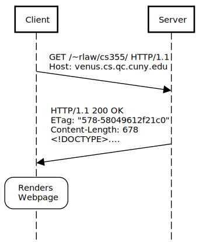
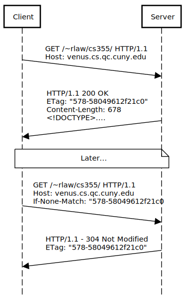
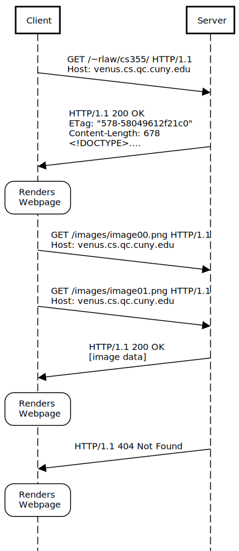
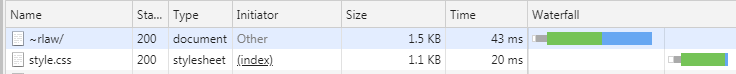

# HyperText Transfer Protocol (HTTP)

HTTP is a structured text protocol used to exchange hypertext on the Internet.  It is most notably used as the foundation for the World Wide Web.

Other Popular Protocols

* **File Transfer**: FTP, SFTP
* **Remote Access** : SSH, *RDP (Microsoft)*, *Telnet (Insecure)*
* **P2P**: Bittorent
* **Email**: SMTP, POP3, IMAP
* **Chat**: IRC

## World Wide Web (WWW)

The collection of publicly available documents and multimedia accessible by the HTTP protocol.

### Things outside the scope of the WWW

* **Online Games** (Ex. Counterstrike, World of Warcraft)
* **P2P Networks** (Bittorent Protocol)
* **Email** (Ex. Outlook, Thunderbird)
* **Cloud Services** (Ex. Dropbox, Drive, OneDrive)

## Client Server Model

HTTP Operates on a client server model.  There are two types of machines:

### Client

1. Make requests
2. Waits for a response
3. Process Response

### Server

1. Wait for requests
2. Process requests
3. Send response

## HTTP Flow



An HTTP sequence diagram abstracts away the three-way opening handshake, the four-way closing handshake, acknowledgement segments, as well as sequence numbers and acknowledgement numbers.  These all still exist under the hood (we can see them with WireShark), but on the application layer we hide those details.  We essentially only care about the segments TCP would categorize as "Data".


### HTTP Request

An HTTP request is **structured text** composed of at minimum a URL to a desired resource.  Usually there will be additional data used to customize the request.  (e.g. Browser information, preferred language, cookie data, supported compression methods and character sets)

```http
GET /~rlaw/cs355/ HTTP/1.1
Host: venus.cs.qc.cuny.edu
Connection: keep-alive
Upgrade-Insecure-Requests: 1
User-Agent: Mozilla/5.0 (Windows NT 6.1; WOW64) AppleWebKit/537.36 (KHTML, like Gecko) Chrome/73.0.3656.0 Safari/537.36
DNT: 1
Accept: text/html,application/xhtml+xml,application/xml;q=0.9,image/webp,image/apng,*/*;q=0.8
Accept-Encoding: gzip, deflate, br
Accept-Language: en-US,en;q=0.9
```

### HTTP Response

An HTTP response is sent back to a client that has made a request.  This response is also formatted as structured text.  It includes an HTTP status code, header information, and optionally a file.

```http
HTTP/1.1 200 OK
Date: Sat, 26 Jan 2019 10:31:03 GMT
Server: Apache/2.4.6 (CentOS) OpenSSL/1.0.2k-fips mod_auth_gssapi/1.5.1 mod_fcgid/2.3.9 mod_nss/1.0.14 NSS/3.28.4 PHP/7.0.33 mod_wsgi/3.4 Python/2.7.5
Last-Modified: Fri, 25 Jan 2019 14:45:35 GMT
ETag: "578-58049612f21c0"
Accept-Ranges: bytes
Content-Length: 678
Keep-Alive: timeout=5, max=100
Connection: Keep-Alive
Content-Type: text/html; charset=UTF-8
Set-Cookie: BIGipServervenus_cs.app~venus_cs_pool=3033728149.47873.0000; path=/; Httponly; Secure
Vary: Accept-Encoding
Content-Encoding: gzip

<!DOCTYPE>....
```

After the last line of the HTTP response header, the content is then delivered (eg. web page, image, style sheet, script).

#### Status Codes

HTTP Status codes are a standardized way to describe the response being returned.  Since most clients are handling many requests at a time it is important to be able to quickly differentiate successful and unsuccessful requests.  Generally status codes fall into 4 categories:

* 2XX Success
* 3XX Redirection
* 4XX Client errors
* 5XX Server errors

##### Common Codes

* 200 OK
* 304 Not Modified
* 403 Forbidden
* 404 Not Found
* 500 Internal Server Error

### Speeding Up Revisits with Headers

A second visit to the same site generates the following request:

```http
GET /~rlaw/cs355/ HTTP/1.1
Host: venus.cs.qc.cuny.edu
Connection: keep-alive
Cache-Control: max-age=0
Upgrade-Insecure-Requests: 1
User-Agent: Mozilla/5.0 (Windows NT 6.1; WOW64) AppleWebKit/537.36 (KHTML, like Gecko) Chrome/73.0.3656.0 Safari/537.36
DNT: 1
Accept: text/html,application/xhtml+xml,application/xml;q=0.9,image/webp,image/apng,*/*;q=0.8
Accept-Encoding: gzip, deflate, br
Accept-Language: en-US,en;q=0.9
Cookie: BIGipServervenus_cs.app~venus_cs_pool=3033728149.47873.0000
If-None-Match: "578-58049612f21c0"
If-Modified-Since: Fri, 25 Jan 2019 14:45:35 GMT
```

and receives the following response

```http
HTTP/1.1 304 Not Modified
Date: Sat, 26 Jan 2019 10:33:42 GMT
Server: Apache/2.4.6 (CentOS) OpenSSL/1.0.2k-fips mod_auth_gssapi/1.5.1 mod_fcgid/2.3.9 mod_nss/1.0.14 NSS/3.28.4 PHP/7.0.33 mod_wsgi/3.4 Python/2.7.5
Connection: Keep-Alive
Keep-Alive: timeout=5, max=100
ETag: "578-58049612f21c0"
```

Notice that this request has no Content (Content-Length is not sent) 

In this **HTTP request** the client sent an additional header `If-None-Match: "578-58049612f21c0"`

This corresponds to the `Etag` field in the original response.

The client is telling the server that it previously received a file with an identifier of `"578-58049612f21c0"`

The server responses with a 304, telling the client that the file with that specific ETag was not changed since it made the previous request and to keep using it.  In this example we saved 678 bytes of content from being downloaded at the cost of a slightly larger header, but this scales well for larger content as the cost of the ETag is constant.




## Browser

A web browser is client software that automates the process of creating and sending HTTP requests and waiting on and processing HTTP responses.  If the file returned is a HTML document a browser will then attempt to render the result.  Many browsers today can render other common documents like PDF's as well.  For files a browser does not understand it will skip the rendering process, downloading them only.

Browsers make it such that the only thing an end-user needs to make a HTTP request is the URL, provided either by keyboard or by clicking on a link in another HTML document.

### Secondary Requests

When a browser receives an HTML document, it will start parsing the HTML code and if that document has embedded resources like images, audio, video, stylesheets, or scripts; the browser will automatically make secondary requests for those resources, typically done in parallel.



In this example the web page likely has two embedded image tags that point to `images/image00.png` and `images/image01.png` and as the web page is being rendered, two new GET requests are sent.  The first request is successful `200 OK` and the page will load the image into the specified location.  The second request returns a `404 Not Found` and your browser will likely display something like this.


It is getting common for stylesheets and scripts to also have embedded content inside of them which creates tertiary requests that only start downloading after the secondary requests has been parsed.

We can observe this by vising a website and looking at the Network tab of the Browser Developer Tools (`CTRL + SHIFT + J`)  Here we can see a <u>waterfall chart</u> which illustrates the sequence of requests and responses and how much time it takes for the browser to download, parse, and render the content on a web page.



## Stateless

HTTP is a **stateless protocol**.  This means by itself it cannot associate one request with another.  There's no memory.  Given the same parameters in an HTTP request we can expect the same resulting response.

We will have tools later to emulate state, but these often require a *client that is willing to cooperate*.  If you are looking to do something like block access to a specific client, it is very difficult to do using only HTTP because even if you give a client tracking headers (like cookies), the client can discard them.
