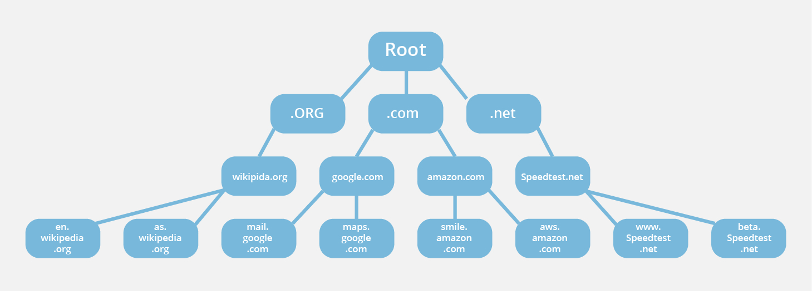
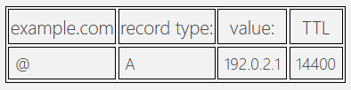

# Domain Name System (DNS)

Converts human readable address into IP addresses.

example.com → 93.184.216.34

Previously we used the function `dns.resolve(domain)` to convert a domain name into an IP address.  This is required because computers understand IP addresses, but it's hard to remember that `172.217.3.206` is `google.com` and even if we could, that IP address could change in the future.

Typically your home router will be configured to use the DNS server provided by your ISP.  This can be changed to one of multiple public DNS servers on the web including:

* 1.1.1.1 and 1.0.0.1 - Cloudflare DNS

* 8.8.8.8 and 8.8.4.4 - Google Public DNS

* 208.67.222.222 and 208.67.220.220 - OpenDNS

  

## DNS Blocking

There are even some DNS servers that block certain content by either returning a failure to resolve the address, or pointing to a different website.

* Adguard DNS provides DNS servers that do not resolve domains owned by advertisers.
* Many countries use DNS as a censorship tool, preventing certain domains from being resolved.

## Types of DNS Servers

* Recursive Resolver
* Root Name Server
* Top Level Domain (TLD) Server
* Authoritative Name Server

## DNS Algorithm

1. Your computer makes a DNS request for a domain `m.example.com`  It knows of a DNS server because there is a default address supplied to the router for all these requests.

2. The request is received by the DNS Recursive resolver.  It takes over the job of resolving the domain.

3. The resolver checks one of 600 Root Name Servers to resolve the top level domain `.com`

   

4. The root name server returns back two records, a NS record and an A record.

   * The NS record points to the domain of the Top Level Domain name server for `.com` which is `a.gtld-servers.net`

   * The A record for `a.gtld-servers.net` which contains the IP address (192.5.6.30) of that server.

5. This Top Level Domain server is in charge of handling all `.com` domains.  It has a record for every registered website ending in `.com`  The DNS recursive resolver queries the TLD server the DNS request for `m.example.com`

6. Behaving similarly to before we are returned two records, a NS record and an A record

   * The NS record points to the domain of the name server for `example.com` which is `ns1.example.com`

   * The A record for `ns1.example.com` which contains the IP address (93.184.216.34) of that server.

7. This Authoritative domain server deals with all traffic under `example.com` and it's subdomains.  Our recursive resolver makes one last call to the Authoritative domain server querying it again to find `m.example.com`  

   * It returns back an A record with `94.20.20.20`

8. The recursive resolver forwards the A record to the client who now has the correct IP address.

9. It also stores the result in it's DNS cache so that future DNS requests can be made faster.

   

## Records

The two types of DNS records that interest us are the NS and A records.  NS records point to the next name server that should be queried to resolve the domain.  The A record contains the IP address of a queried domain. 

### NS

### A

## Round Robin DNS

It is most common to return a single A record at the completion of a DNS request, but it is possible to return multiple. (eg. cat.com)  This is typically used as a load balancing technique.  When a DNS server is queried to resolve an A record, if it has multiple records it will return back the first one in the list and then moving that one to the end of it.  The following call will get the A record of the next server and this loops.  Architecting your name servers in this fashion is one technique to scale your website such that the load is evenly distributed among each server.

